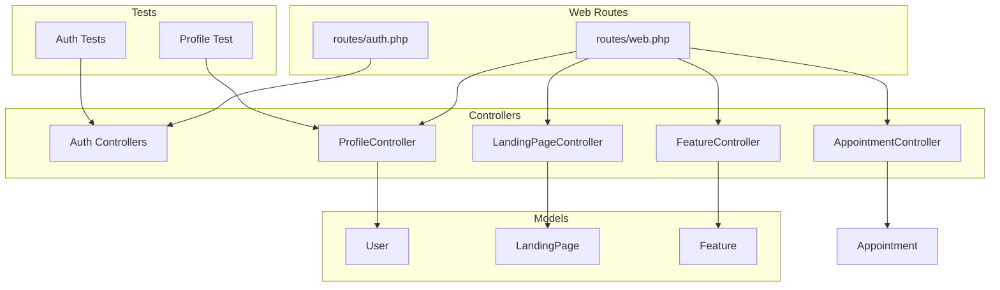
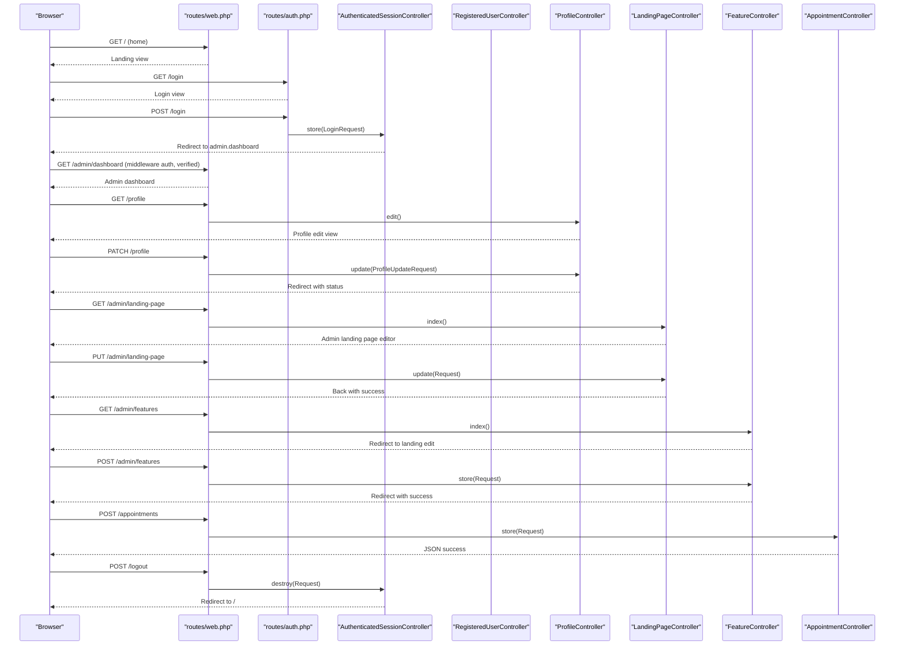
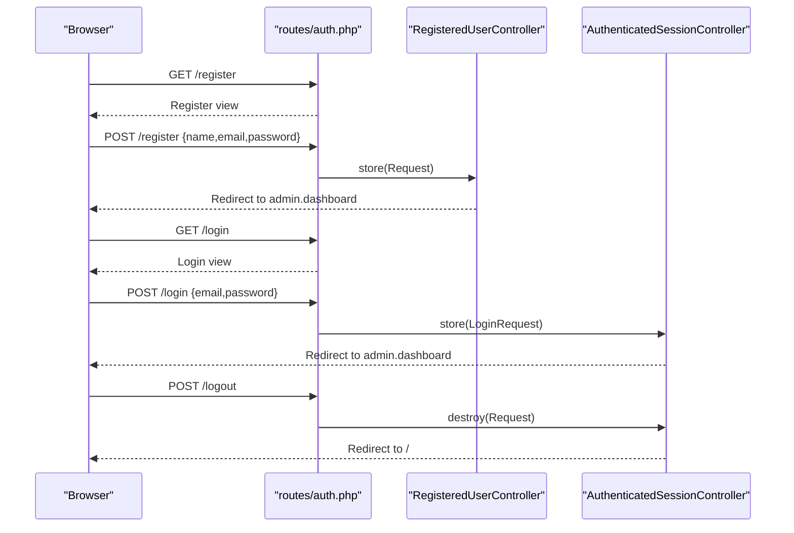
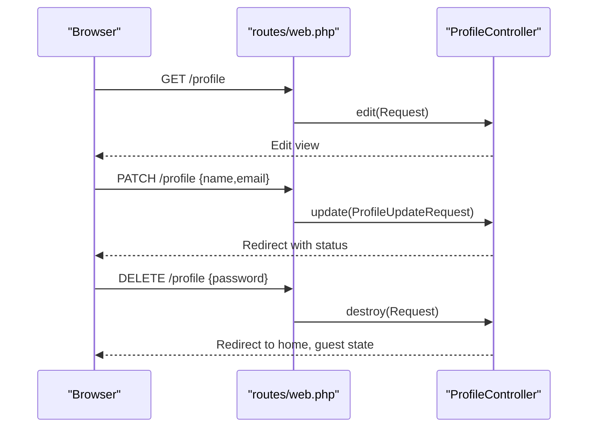
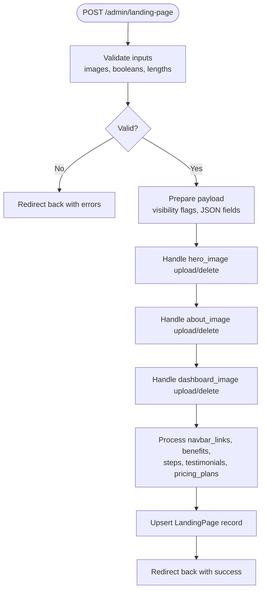
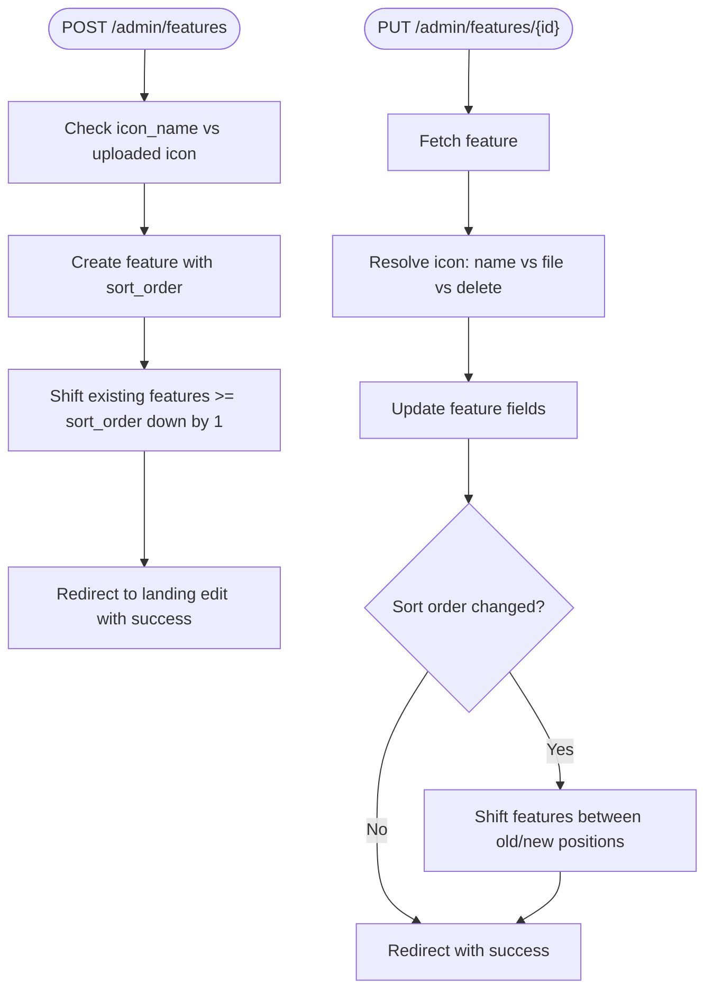
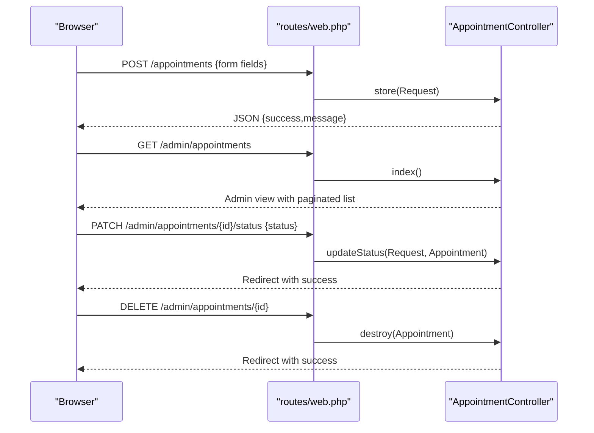
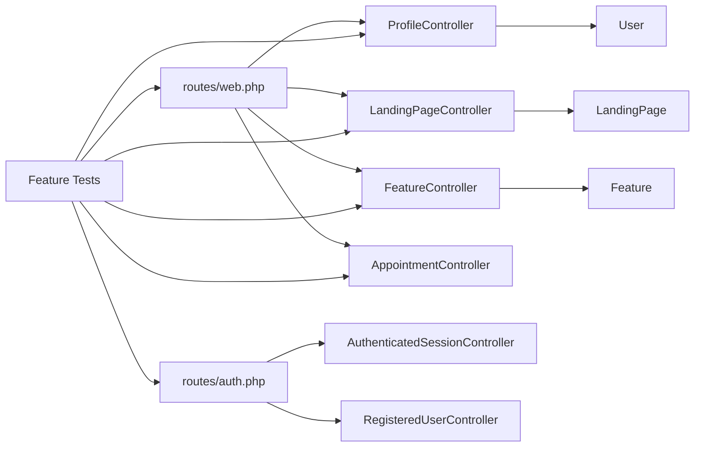

# Feature Testing

<cite>
**Referenced Files in This Document**
- [AuthenticatedSessionController.php](file://app/Http/Controllers/Auth/AuthenticatedSessionController.php)
- [RegisteredUserController.php](file://app/Http/Controllers/Auth/RegisteredUserController.php)
- [ProfileController.php](file://app/Http/Controllers/ProfileController.php)
- [LandingPageController.php](file://app/Http/Controllers/LandingPageController.php)
- [FeatureController.php](file://app/Http/Controllers/FeatureController.php)
- [AppointmentController.php](file://app/Http/Controllers/AppointmentController.php)
- [web.php](file://routes/web.php)
- [auth.php](file://routes/auth.php)
- [AuthenticationTest.php](file://tests/Feature/Auth/AuthenticationTest.php)
- [RegistrationTest.php](file://tests/Feature/Auth/RegistrationTest.php)
- [ProfileTest.php](file://tests/Feature/ProfileTest.php)
- [PasswordResetTest.php](file://tests/Feature/Auth/PasswordResetTest.php)
- [PasswordUpdateTest.php](file://tests/Feature/Auth/PasswordUpdateTest.php)
- [User.php](file://app/Models/User.php)
- [LandingPage.php](file://app/Models/LandingPage.php)
- [Feature.php](file://app/Models/Feature.php)
</cite>

## Table of Contents
1. [Introduction](#introduction)
2. [Project Structure](#project-structure)
3. [Core Components](#core-components)
4. [Architecture Overview](#architecture-overview)
5. [Detailed Component Analysis](#detailed-component-analysis)
6. [Dependency Analysis](#dependency-analysis)
7. [Performance Considerations](#performance-considerations)
8. [Troubleshooting Guide](#troubleshooting-guide)
9. [Conclusion](#conclusion)
10. [Appendices](#appendices)

## Introduction
This document provides comprehensive feature testing guidance for the ClinicalLog CMS, focusing on user workflows and system interactions. It covers end-to-end scenarios for authentication, profile management, content editing, and administrative operations. Testing patterns include user registration and login/logout, password management, role-based access control via middleware, landing page editing, feature management, appointment processing, and file upload operations. Guidance is provided for browser automation testing, form submissions, navigation flows, response validation, UI interactions, session management, and state persistence across multiple requests.

## Project Structure
The CMS follows Laravel’s MVC pattern with dedicated controllers for authentication, profiles, landing pages, features, and appointments. Routes are split into web and auth route files, separating guest and authenticated flows. Feature tests reside under the tests/Feature directory, grouped by domain (e.g., Auth, Profile).

**Diagram sources**
- [web.php:1-77](file://routes/web.php#L1-L77)
- [auth.php:1-60](file://routes/auth.php#L1-L60)
- [AuthenticatedSessionController.php:1-48](file://app/Http/Controllers/Auth/AuthenticatedSessionController.php#L1-L48)
- [RegisteredUserController.php:1-52](file://app/Http/Controllers/Auth/RegisteredUserController.php#L1-L52)
- [ProfileController.php:1-61](file://app/Http/Controllers/ProfileController.php#L1-L61)
- [LandingPageController.php:1-224](file://app/Http/Controllers/LandingPageController.php#L1-L224)
- [FeatureController.php:1-156](file://app/Http/Controllers/FeatureController.php#L1-L156)
- [AppointmentController.php:1-77](file://app/Http/Controllers/AppointmentController.php#L1-L77)
- [User.php:1-33](file://app/Models/User.php#L1-L33)
- [LandingPage.php:1-59](file://app/Models/LandingPage.php#L1-L59)
- [Feature.php:1-17](file://app/Models/Feature.php#L1-L17)

**Section sources**
- [web.php:1-77](file://routes/web.php#L1-L77)
- [auth.php:1-60](file://routes/auth.php#L1-L60)

## Core Components
- Authentication Controllers: Handle login, logout, registration, password reset, email verification, and password updates.
- Profile Controller: Manages profile edits, password changes, and account deletion.
- Landing Page Controller: Edits landing page content, visibility flags, images, and structured content (benefits, steps, testimonials, pricing).
- Feature Controller: Manages feature items with icon selection (Lucide icon name or uploaded file), sorting, and CRUD operations.
- Appointment Controller: Processes appointment requests, lists admin appointments, updates statuses, and deletes entries.
- Routing: Public home, terms, and dashboard; authenticated admin routes for CMS and management.

Key testing patterns:
- Use RefreshDatabase to isolate tests and seed minimal data.
- Utilize actingAs for authenticated flows.
- Validate redirects, session state, and model changes.
- Assert notifications for password reset flows.
- Validate file uploads and deletions for images and icons.

**Section sources**
- [AuthenticatedSessionController.php:1-48](file://app/Http/Controllers/Auth/AuthenticatedSessionController.php#L1-L48)
- [RegisteredUserController.php:1-52](file://app/Http/Controllers/Auth/RegisteredUserController.php#L1-L52)
- [ProfileController.php:1-61](file://app/Http/Controllers/ProfileController.php#L1-L61)
- [LandingPageController.php:1-224](file://app/Http/Controllers/LandingPageController.php#L1-L224)
- [FeatureController.php:1-156](file://app/Http/Controllers/FeatureController.php#L1-L156)
- [AppointmentController.php:1-77](file://app/Http/Controllers/AppointmentController.php#L1-L77)
- [AuthenticationTest.php:1-55](file://tests/Feature/Auth/AuthenticationTest.php#L1-L55)
- [RegistrationTest.php:1-32](file://tests/Feature/Auth/RegistrationTest.php#L1-L32)
- [ProfileTest.php:1-100](file://tests/Feature/ProfileTest.php#L1-L100)
- [PasswordResetTest.php:1-74](file://tests/Feature/Auth/PasswordResetTest.php#L1-L74)
- [PasswordUpdateTest.php:1-52](file://tests/Feature/Auth/PasswordUpdateTest.php#L1-L52)

## Architecture Overview
The CMS enforces role-based access control via middleware on admin routes. Authentication routes are separated for guests, while authenticated routes handle admin dashboards, CMS editing, and management.

**Diagram sources**
- [web.php:1-77](file://routes/web.php#L1-L77)
- [auth.php:1-60](file://routes/auth.php#L1-L60)
- [AuthenticatedSessionController.php:1-48](file://app/Http/Controllers/Auth/AuthenticatedSessionController.php#L1-L48)
- [RegisteredUserController.php:1-52](file://app/Http/Controllers/Auth/RegisteredUserController.php#L1-L52)
- [ProfileController.php:1-61](file://app/Http/Controllers/ProfileController.php#L1-L61)
- [LandingPageController.php:1-224](file://app/Http/Controllers/LandingPageController.php#L1-L224)
- [FeatureController.php:1-156](file://app/Http/Controllers/FeatureController.php#L1-L156)
- [AppointmentController.php:1-77](file://app/Http/Controllers/AppointmentController.php#L1-L77)

## Detailed Component Analysis

### Authentication Workflows
End-to-end scenarios:
- Login screen rendering and successful authentication leading to admin dashboard.
- Invalid credentials prevent authentication.
- Logout invalidates session and regenerates CSRF token.
- Registration creates a new user and auto-authenticates to dashboard.
- Password reset link request and token-based reset flow.

Testing patterns:
- Use actingAs for authenticated tests.
- Validate redirects to intended destinations.
- Assert guest vs authenticated states.
- Fake notifications for reset flows and assert sent notifications.
- Validate request validation errors for wrong passwords.

**Diagram sources**
- [auth.php:14-59](file://routes/auth.php#L14-L59)
- [RegisteredUserController.php:31-50](file://app/Http/Controllers/Auth/RegisteredUserController.php#L31-L50)
- [AuthenticatedSessionController.php:25-46](file://app/Http/Controllers/Auth/AuthenticatedSessionController.php#L25-L46)

**Section sources**
- [AuthenticationTest.php:1-55](file://tests/Feature/Auth/AuthenticationTest.php#L1-L55)
- [RegistrationTest.php:1-32](file://tests/Feature/Auth/RegistrationTest.php#L1-L32)
- [PasswordResetTest.php:1-74](file://tests/Feature/Auth/PasswordResetTest.php#L1-L74)
- [PasswordUpdateTest.php:1-52](file://tests/Feature/Auth/PasswordUpdateTest.php#L1-L52)
- [RegisteredUserController.php:31-50](file://app/Http/Controllers/Auth/RegisteredUserController.php#L31-L50)
- [AuthenticatedSessionController.php:25-46](file://app/Http/Controllers/Auth/AuthenticatedSessionController.php#L25-L46)

### Profile Management
Scenarios:
- Access profile edit page.
- Update profile information; changing email resets verification status.
- Delete account with current password confirmation.
- Password update via dedicated endpoint with validation.

Validation targets:
- Session errors for incorrect current password during deletion and password update.
- Redirects and status messages.
- Model assertions for updated fields.

**Diagram sources**
- [web.php:47-51](file://routes/web.php#L47-L51)
- [ProfileController.php:17-59](file://app/Http/Controllers/ProfileController.php#L17-L59)

**Section sources**
- [ProfileTest.php:1-100](file://tests/Feature/ProfileTest.php#L1-L100)
- [ProfileController.php:27-59](file://app/Http/Controllers/ProfileController.php#L27-L59)

### Landing Page Editing
Scenarios:
- Load landing page editor with existing landing data and paginated features.
- Update hero/about/dashboard sections with optional images and visibility flags.
- Upload or delete hero, about, and dashboard images.
- Manage structured content: navbar links, benefits, steps, testimonials, pricing plans.
- Toggle visibility flags for sections.

Validation targets:
- Request validation for image types/sizes and field lengths.
- Image cleanup on delete or replacement.
- JSON parsing for arrays; sanitization of empty entries.
- Success flash message and redirect back.

**Diagram sources**
- [LandingPageController.php:19-222](file://app/Http/Controllers/LandingPageController.php#L19-L222)

**Section sources**
- [LandingPageController.php:11-222](file://app/Http/Controllers/LandingPageController.php#L11-L222)
- [web.php:52-54](file://routes/web.php#L52-L54)

### Feature Management
Scenarios:
- Create a feature with either Lucide icon name or uploaded icon file.
- Reorder features by adjusting sort order; shifting others accordingly.
- Update feature details and switch between Lucide icon name and uploaded icon.
- Delete a feature; clean up icon file and adjust sort order.

Validation targets:
- Icon selection precedence: Lucide name clears uploaded icon; uploaded icon clears Lucide name.
- Sort order clamping and shifting logic.
- File deletion on update/delete.
- Success flash messages and redirects.

**Diagram sources**
- [FeatureController.php:22-132](file://app/Http/Controllers/FeatureController.php#L22-L132)

**Section sources**
- [FeatureController.php:11-156](file://app/Http/Controllers/FeatureController.php#L11-L156)
- [web.php:56-62](file://routes/web.php#L56-L62)

### Appointment Processing
Scenarios:
- Submit appointment request via JSON endpoint; validates required fields and date/time constraints.
- Admin dashboard lists recent appointments with pagination.
- Update appointment status with strict enum validation.
- Delete appointment.

Validation targets:
- JSON response for successful submission.
- Pagination and ordering in admin listing.
- Status enum validation and success message.
- Deletion success message.

**Diagram sources**
- [web.php:26-74](file://routes/web.php#L26-L74)
- [AppointmentController.php:14-76](file://app/Http/Controllers/AppointmentController.php#L14-L76)

**Section sources**
- [AppointmentController.php:14-76](file://app/Http/Controllers/AppointmentController.php#L14-L76)
- [web.php:26-74](file://routes/web.php#L26-L74)

### Conceptual Overview
This section outlines general testing strategies applicable across components:
- Browser automation: Use Laravel Dusk or similar to simulate user actions (clicks, typing, file uploads).
- Form submissions: Target specific forms by action/method and validate redirects/messages.
- Navigation flows: Follow middleware-protected routes and assert redirects to login when unauthenticated.
- Response validation: Assert status codes, redirects, JSON payloads, and flash messages.
- Session management: Verify authenticated/guest states, session invalidation on logout, and CSRF token regeneration.
- State persistence: After edits, assert model changes and media cleanup.

[No sources needed since this section doesn't analyze specific source files]

## Dependency Analysis
The routing layer orchestrates controller actions. Controllers depend on Eloquent models for persistence and Storage for file operations. Tests rely on factories and database refresh to maintain isolation.

**Diagram sources**
- [web.php:1-77](file://routes/web.php#L1-L77)
- [auth.php:1-60](file://routes/auth.php#L1-L60)
- [ProfileController.php:1-61](file://app/Http/Controllers/ProfileController.php#L1-L61)
- [LandingPageController.php:1-224](file://app/Http/Controllers/LandingPageController.php#L1-L224)
- [FeatureController.php:1-156](file://app/Http/Controllers/FeatureController.php#L1-L156)
- [AppointmentController.php:1-77](file://app/Http/Controllers/AppointmentController.php#L1-L77)
- [User.php:1-33](file://app/Models/User.php#L1-L33)
- [LandingPage.php:1-59](file://app/Models/LandingPage.php#L1-L59)
- [Feature.php:1-17](file://app/Models/Feature.php#L1-L17)

**Section sources**
- [web.php:1-77](file://routes/web.php#L1-L77)
- [auth.php:1-60](file://routes/auth.php#L1-L60)
- [User.php:1-33](file://app/Models/User.php#L1-L33)
- [LandingPage.php:1-59](file://app/Models/LandingPage.php#L1-L59)
- [Feature.php:1-17](file://app/Models/Feature.php#L1-L17)

## Performance Considerations
- Prefer lightweight factories and minimal datasets in tests to reduce overhead.
- Use paginate in admin listings to avoid heavy payloads.
- Limit file sizes for uploads in tests to speed up execution.
- Avoid unnecessary redirects in tests by asserting intermediate states when possible.

[No sources needed since this section provides general guidance]

## Troubleshooting Guide
Common issues and resolutions:
- Authentication failures: Ensure correct credentials and that the user is not banned or unverified. Verify middleware stack for guest/auth routes.
- Session not invalidated on logout: Confirm controller destroys guard session, invalidates session, and regenerates CSRF token.
- Profile update errors: Validate request rules and ensure email uniqueness. Changing email resets verification status.
- Feature reorder anomalies: Confirm sort order clamping and shifting logic; verify no gaps after deletions.
- Landing page image cleanup: On update/delete, ensure previous files are removed from storage.
- Appointment status validation: Only accepted values should be used; otherwise, validation errors occur.
- Password reset not received: Fake notifications and assert sent; verify signed token generation and expiration.

**Section sources**
- [AuthenticatedSessionController.php:37-46](file://app/Http/Controllers/Auth/AuthenticatedSessionController.php#L37-L46)
- [ProfileController.php:43-59](file://app/Http/Controllers/ProfileController.php#L43-L59)
- [FeatureController.php:94-121](file://app/Http/Controllers/FeatureController.php#L94-L121)
- [LandingPageController.php:77-114](file://app/Http/Controllers/LandingPageController.php#L77-L114)
- [AppointmentController.php:55-66](file://app/Http/Controllers/AppointmentController.php#L55-L66)
- [PasswordResetTest.php:22-31](file://tests/Feature/Auth/PasswordResetTest.php#L22-L31)

## Conclusion
The ClinicalLog CMS provides a robust set of authenticated admin workflows for managing content and users. Feature tests should validate end-to-end flows, middleware-protected routes, session management, and persistence of model and file changes. By leveraging the existing routing and controller patterns, teams can implement reliable browser automation and assertion strategies to ensure quality and stability across user journeys.

[No sources needed since this section summarizes without analyzing specific files]

## Appendices
- Testing checklist:
  - Authentication: render login/register, valid/invalid credentials, logout.
  - Registration: render registration, create user, redirect to dashboard.
  - Profile: edit, update info, change email, delete account with confirmation.
  - Password: update with correct current password, reject wrong current password.
  - Password reset: request link, open reset page, submit with token, redirect to login.
  - Landing page: load editor, update sections, upload/delete images, toggle visibility, manage structured content.
  - Features: create with icon/name, reorder, update icon/name, delete with cleanup.
  - Appointments: submit form, list in admin, update status, delete entry.
  - File uploads: validate types/sizes, cleanup on delete/update, storage paths.

[No sources needed since this section provides general guidance]