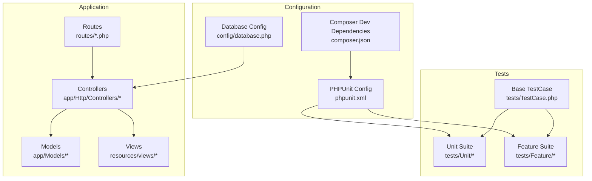
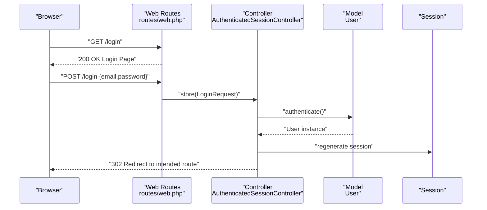
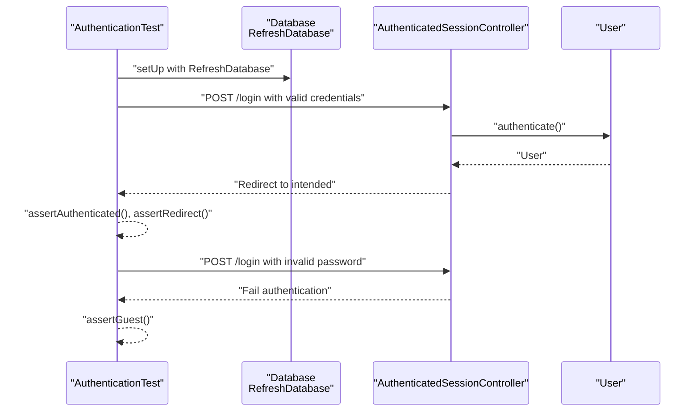
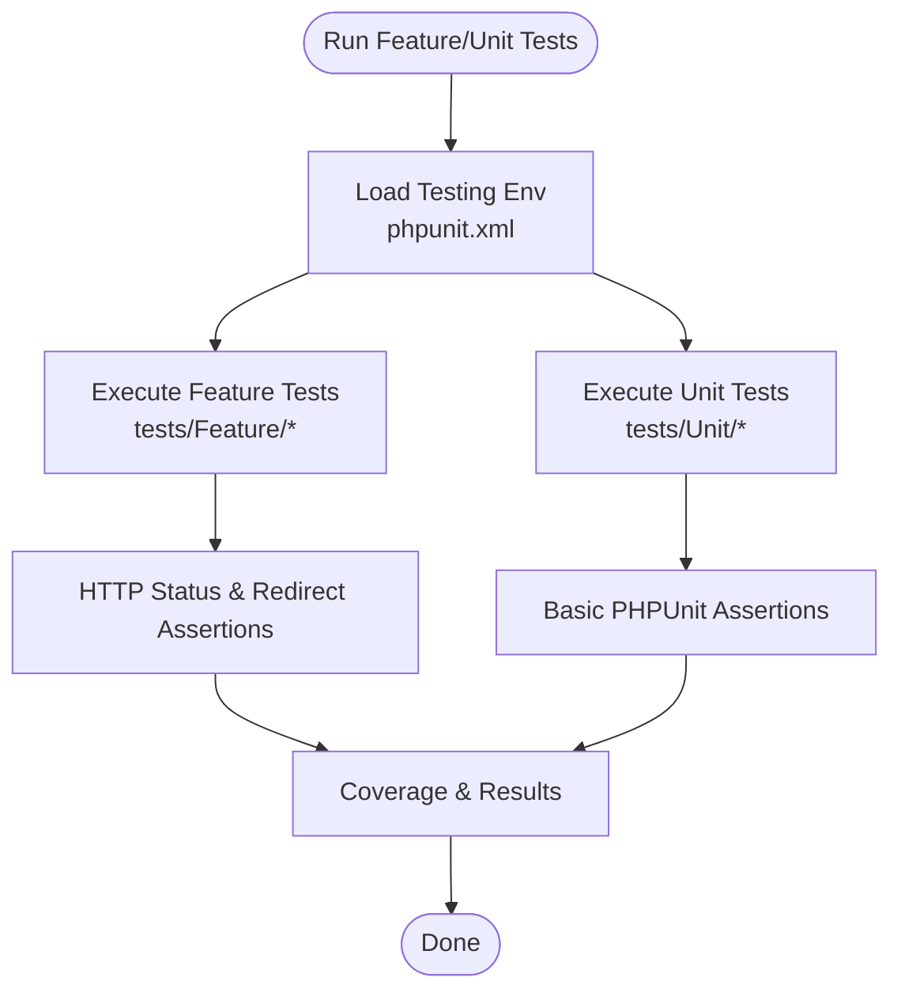
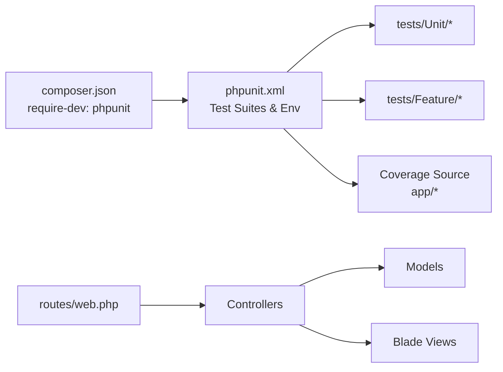

# Quality Assurance & Best Practices

<cite>
**Referenced Files in This Document**
- [phpunit.xml](file://phpunit.xml)
- [composer.json](file://composer.json)
- [tests/TestCase.php](file://tests/TestCase.php)
- [tests/Feature/Auth/AuthenticationTest.php](file://tests/Feature/Auth/AuthenticationTest.php)
- [tests/Feature/ExampleTest.php](file://tests/Feature/ExampleTest.php)
- [tests/Unit/ExampleTest.php](file://tests/Unit/ExampleTest.php)
- [config/database.php](file://config/database.php)
- [routes/web.php](file://routes/web.php)
- [app/Http/Controllers/Auth/AuthenticatedSessionController.php](file://app/Http/Controllers/Auth/AuthenticatedSessionController.php)
- [app/Models/User.php](file://app/Models/User.php)
- [README.md](file://README.md)
</cite>

## Table of Contents
1. [Introduction](#introduction)
2. [Project Structure](#project-structure)
3. [Core Components](#core-components)
4. [Architecture Overview](#architecture-overview)
5. [Detailed Component Analysis](#detailed-component-analysis)
6. [Dependency Analysis](#dependency-analysis)
7. [Performance Considerations](#performance-considerations)
8. [Security Testing Methodologies](#security-testing-methodologies)
9. [Accessibility Testing Procedures](#accessibility-testing-procedures)
10. [Continuous Integration Setup](#continuous-integration-setup)
11. [Automated Testing Workflows](#automated-testing-workflows)
12. [Regression Testing Strategies](#regression-testing-strategies)
13. [Code Coverage Analysis](#code-coverage-analysis)
14. [Test Metrics Interpretation](#test-metrics-interpretation)
15. [Quality Gates Implementation](#quality-gates-implementation)
16. [Testing Standards](#testing-standards)
17. [Code Review Processes for Test Code](#code-review-processes-for-test-code)
18. [Maintainability Guidelines](#maintainability-guidelines)
19. [Test Documentation Standards](#test-documentation-standards)
20. [Bug Tracking Integration](#bug-tracking-integration)
21. [Quality Reporting Mechanisms](#quality-reporting-mechanisms)
22. [Test Maintenance and Refactoring](#test-maintenance-and-refactoring)
23. [Establishing a Testing Culture](#establishing-a-testing-culture)
24. [Conclusion](#conclusion)

## Introduction
This document defines comprehensive quality assurance practices for the ClinicalLog CMS, grounded in the existing Laravel application structure and testing configuration. It consolidates current capabilities with actionable recommendations for code coverage, test metrics, quality gates, continuous integration, automated workflows, regression testing, performance and security testing, accessibility compliance, documentation, bug tracking, reporting, maintainability, and team culture.

## Project Structure
The project follows Laravel conventions with a clear separation between application code, configuration, and tests. The testing suite is organized into Unit and Feature test suites, with a base TestCase class and environment-specific configuration for testing.

**Diagram sources**
- [routes/web.php:1-77](file://routes/web.php#L1-L77)
- [config/database.php:1-185](file://config/database.php#L1-L185)
- [phpunit.xml:1-37](file://phpunit.xml#L1-L37)
- [composer.json:1-88](file://composer.json#L1-L88)
- [tests/TestCase.php:1-11](file://tests/TestCase.php#L1-L11)

**Section sources**
- [routes/web.php:1-77](file://routes/web.php#L1-L77)
- [config/database.php:1-185](file://config/database.php#L1-L185)
- [phpunit.xml:1-37](file://phpunit.xml#L1-L37)
- [composer.json:1-88](file://composer.json#L1-L88)
- [tests/TestCase.php:1-11](file://tests/TestCase.php#L1-L11)

## Core Components
- PHPUnit configuration defines two test suites (Unit and Feature), includes the application source for coverage, and sets environment variables optimized for testing (in-memory SQLite, array caches, sync queues, etc.).
- Composer scripts provide a unified test command invoking Laravel's test runner.
- The base TestCase class establishes the foundation for all tests.
- Feature tests demonstrate browser-like interactions against routes and controllers, validated through assertions.

Key implementation references:
- Test suites and source inclusion: [phpunit.xml:7-19](file://phpunit.xml#L7-L19)
- Environment overrides for testing: [phpunit.xml:20-35](file://phpunit.xml#L20-L35)
- Test script invocation: [composer.json:48-51](file://composer.json#L48-L51)
- Base test harness: [tests/TestCase.php:7-10](file://tests/TestCase.php#L7-L10)
- Feature test example: [tests/Feature/ExampleTest.php:13-18](file://tests/Feature/ExampleTest.php#L13-L18)

**Section sources**
- [phpunit.xml:1-37](file://phpunit.xml#L1-L37)
- [composer.json:48-51](file://composer.json#L48-L51)
- [tests/TestCase.php:1-11](file://tests/TestCase.php#L1-L11)
- [tests/Feature/ExampleTest.php:1-20](file://tests/Feature/ExampleTest.php#L1-L20)

## Architecture Overview
The CMS exposes web routes secured by authentication middleware. Feature tests exercise these routes and controller actions, validating successful responses and redirects.

**Diagram sources**
- [routes/web.php:37-45](file://routes/web.php#L37-L45)
- [app/Http/Controllers/Auth/AuthenticatedSessionController.php:25-32](file://app/Http/Controllers/Auth/AuthenticatedSessionController.php#L25-L32)
- [app/Models/User.php:15-32](file://app/Models/User.php#L15-L32)

**Section sources**
- [routes/web.php:1-77](file://routes/web.php#L1-L77)
- [app/Http/Controllers/Auth/AuthenticatedSessionController.php:1-48](file://app/Http/Controllers/Auth/AuthenticatedSessionController.php#L1-L48)
- [app/Models/User.php:1-33](file://app/Models/User.php#L1-L33)

## Detailed Component Analysis

### Authentication Feature Tests
These tests validate login, invalid credentials, and logout flows using database refresh and acting-as patterns.

**Diagram sources**
- [tests/Feature/Auth/AuthenticationTest.php:20-31](file://tests/Feature/Auth/AuthenticationTest.php#L20-L31)
- [tests/Feature/Auth/AuthenticationTest.php:33-43](file://tests/Feature/Auth/AuthenticationTest.php#L33-L43)
- [app/Http/Controllers/Auth/AuthenticatedSessionController.php:25-32](file://app/Http/Controllers/Auth/AuthenticatedSessionController.php#L25-L32)
- [app/Models/User.php:15-32](file://app/Models/User.php#L15-L32)

**Section sources**
- [tests/Feature/Auth/AuthenticationTest.php:1-55](file://tests/Feature/Auth/AuthenticationTest.php#L1-L55)
- [app/Http/Controllers/Auth/AuthenticatedSessionController.php:1-48](file://app/Http/Controllers/Auth/AuthenticatedSessionController.php#L1-L48)
- [app/Models/User.php:1-33](file://app/Models/User.php#L1-L33)

### Example Feature and Unit Tests
- A baseline feature test validates home page response codes.
- A unit test demonstrates PHPUnit usage.

**Diagram sources**
- [phpunit.xml:20-35](file://phpunit.xml#L20-L35)
- [tests/Feature/ExampleTest.php:13-18](file://tests/Feature/ExampleTest.php#L13-L18)
- [tests/Unit/ExampleTest.php:12-15](file://tests/Unit/ExampleTest.php#L12-L15)

**Section sources**
- [tests/Feature/ExampleTest.php:1-20](file://tests/Feature/ExampleTest.php#L1-L20)
- [tests/Unit/ExampleTest.php:1-17](file://tests/Unit/ExampleTest.php#L1-L17)

## Dependency Analysis
- PHPUnit is configured as a dev dependency and invoked via Composer scripts.
- The testing environment leverages SQLite in-memory databases and array-backed stores to isolate and accelerate tests.
- Routes define authentication-protected areas where Feature tests can assert middleware behavior.

**Diagram sources**
- [composer.json:13-22](file://composer.json#L13-L22)
- [phpunit.xml:7-19](file://phpunit.xml#L7-L19)
- [routes/web.php:1-77](file://routes/web.php#L1-L77)

**Section sources**
- [composer.json:1-88](file://composer.json#L1-L88)
- [phpunit.xml:1-37](file://phpunit.xml#L1-L37)
- [routes/web.php:1-77](file://routes/web.php#L1-L77)

## Performance Considerations
- Use array-backed cache, session, and queue drivers in the testing environment to minimize I/O overhead.
- Prefer SQLite in-memory databases for speed and isolation.
- Keep Feature tests scoped to representative scenarios; offload heavy computations to Unit tests.
- Leverage database refresh strategies judiciously to avoid unnecessary migrations per test.

Practical references:
- Environment overrides for performance: [phpunit.xml:20-35](file://phpunit.xml#L20-L35)
- Database defaults and connections: [config/database.php:20-45](file://config/database.php#L20-L45)

**Section sources**
- [phpunit.xml:20-35](file://phpunit.xml#L20-L35)
- [config/database.php:1-185](file://config/database.php#L1-L185)

## Security Testing Methodologies
- Input validation and sanitization: Assert request validation errors for malformed inputs in Feature tests.
- Authentication and authorization: Verify middleware enforcement and redirect behavior for unauthenticated or unauthorized requests.
- CSRF protection: Include requests with tokens where applicable in authenticated flows.
- Password handling: Validate hashing and credential comparison through model and controller interactions.

References:
- Authentication controller behavior: [app/Http/Controllers/Auth/AuthenticatedSessionController.php:25-32](file://app/Http/Controllers/Auth/AuthenticatedSessionController.php#L25-L32)
- User model casting: [app/Models/User.php:25-31](file://app/Models/User.php#L25-L31)

**Section sources**
- [app/Http/Controllers/Auth/AuthenticatedSessionController.php:1-48](file://app/Http/Controllers/Auth/AuthenticatedSessionController.php#L1-L48)
- [app/Models/User.php:1-33](file://app/Models/User.php#L1-L33)

## Accessibility Testing Procedures
- Static analysis: Integrate automated checks for missing alt attributes, ARIA roles, and semantic markup in views.
- Dynamic testing: Use browser automation to programmatically verify focus order, keyboard navigation, and screen reader compatibility.
- Linting: Enforce HTML/CSS standards via pre-commit hooks and CI steps.

Note: These are recommended practices aligned with the project’s frontend stack and testing framework.

## Continuous Integration Setup
- Configure CI to run the Composer test script, ensuring environment isolation and deterministic results.
- Store coverage artifacts and publish reports for visibility.
- Gate merges on passing tests and coverage thresholds.

References:
- Test script definition: [composer.json:48-51](file://composer.json#L48-L51)
- PHPUnit configuration: [phpunit.xml:1-37](file://phpunit.xml#L1-L37)

**Section sources**
- [composer.json:48-51](file://composer.json#L48-L51)
- [phpunit.xml:1-37](file://phpunit.xml#L1-L37)

## Automated Testing Workflows
- Local developer workflow: Run the Composer test script to execute all suites.
- Pre-commit hooks: Validate code style and run focused unit tests.
- CI pipeline: Full test suite with coverage collection and report publishing.

References:
- Test command: [composer.json:48-51](file://composer.json#L48-L51)

**Section sources**
- [composer.json:48-51](file://composer.json#L48-L51)

## Regression Testing Strategies
- Feature tests for critical user journeys (login, dashboard access, admin actions).
- Parameterized tests for forms and endpoints to catch edge-case regressions.
- Snapshot-style assertions for templated pages where appropriate.

References:
- Feature test patterns: [tests/Feature/Auth/AuthenticationTest.php:1-55](file://tests/Feature/Auth/AuthenticationTest.php#L1-L55)

**Section sources**
- [tests/Feature/Auth/AuthenticationTest.php:1-55](file://tests/Feature/Auth/AuthenticationTest.php#L1-L55)

## Code Coverage Analysis
- Current configuration includes the application directory for coverage inclusion.
- Recommended extensions: Enable PCOV or Xdebug for line coverage; configure branch coverage for critical paths.
- Coverage targets: Establish minimum thresholds per module (e.g., 80% overall, 90% for controllers and models).

References:
- Coverage source inclusion: [phpunit.xml:15-19](file://phpunit.xml#L15-L19)

**Section sources**
- [phpunit.xml:15-19](file://phpunit.xml#L15-L19)

## Test Metrics Interpretation
- Pass/Fail rates: Track suite-wide pass rate and trend over time.
- Coverage metrics: Monitor line, branch, and method coverage; prioritize high-risk modules.
- Flakiness: Identify intermittent failures and stabilize flaky tests.
- Performance: Measure suite runtime and allocate long-running tests to dedicated jobs.

## Quality Gates Implementation
- Build gate: Fail builds on test failures or coverage below threshold.
- Pull request gate: Require passing tests and coverage approval.
- Canary deployment gate: Enforce regression-free baselines before production promotion.

## Testing Standards
- Naming: Use descriptive test names indicating scenario and expected outcome.
- Organization: Place tests alongside production code by feature; keep suites cohesive.
- Isolation: Avoid cross-test dependencies; reset state between tests.
- Assertions: Prefer intent-revealing assertions; avoid redundant checks.

## Code Review Processes for Test Code
- Review test logic for correctness, completeness, and maintainability.
- Verify coverage expectations and absence of duplication.
- Ensure tests reflect user stories and acceptance criteria.

## Maintainability Guidelines
- Refactor tests alongside production code.
- Replace brittle assertions with behavior-focused ones.
- Decompose large tests into smaller, focused units.

## Test Documentation Standards
- Document test purpose, prerequisites, and expected outcomes.
- Maintain a test inventory categorized by feature area and risk level.

## Bug Tracking Integration
- Link failing tests to bug tickets with repro steps and environment details.
- Use CI logs and coverage reports as evidence in bug reports.

## Quality Reporting Mechanisms
- Publish test summaries and coverage dashboards in CI.
- Share weekly/monthly quality reports with stakeholders.

## Test Maintenance and Refactoring
- Regularly audit and prune obsolete tests.
- Consolidate duplicated fixtures and helpers.
- Upgrade deprecated APIs and assertions.

## Establishing a Testing Culture
- Educate on TDD/BDD principles and benefits.
- Recognize contributions to test quality.
- Encourage pairing on test writing and refactoring.

## Conclusion
ClinicalLog CMS currently provides a solid foundation for quality assurance with PHPUnit, Composer-driven scripts, and environment-tuned configurations. By implementing the recommendations herein—covering coverage, metrics, gates, CI/CD, regression strategies, performance, security, accessibility, documentation, bug tracking, reporting, maintainability, and culture—the project can achieve robust, scalable, and sustainable QA practices aligned with modern web application standards.