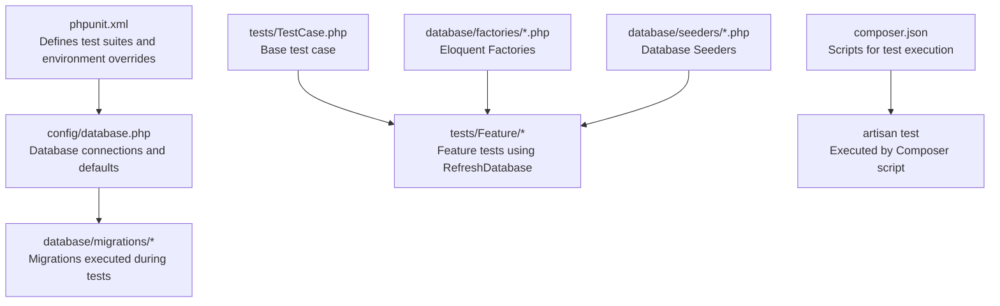
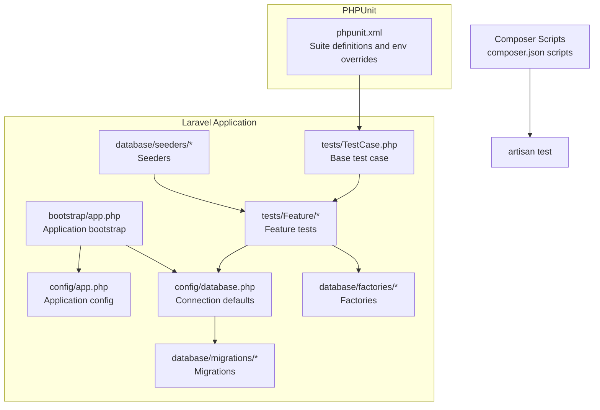
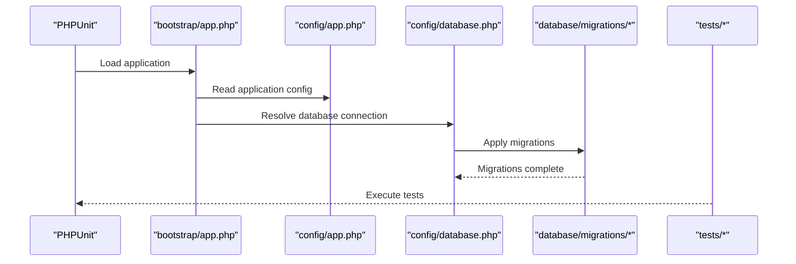
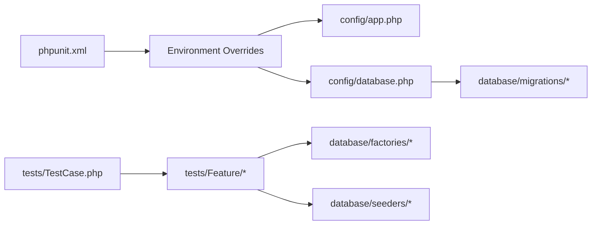

# Test Environment & Configuration

<cite>
**Referenced Files in This Document**
- [phpunit.xml](file://phpunit.xml)
- [TestCase.php](file://tests/TestCase.php)
- [composer.json](file://composer.json)
- [database.php](file://config/database.php)
- [app.php](file://bootstrap/app.php)
- [app.php](file://config/app.php)
- [UserFactory.php](file://database/factories/UserFactory.php)
- [DatabaseSeeder.php](file://database/seeders/DatabaseSeeder.php)
- [0001_01_01_000000_create_users_table.php](file://database/migrations/0001_01_01_000000_create_users_table.php)
- [2026_06_22_024652_create_appointments_table.php](file://database/migrations/2026_06_22_024652_create_appointments_table.php)
- [AuthenticationTest.php](file://tests/Feature/Auth/AuthenticationTest.php)
- [ExampleTest.php](file://tests/Feature/ExampleTest.php)
</cite>

## Table of Contents
1. [Introduction](#introduction)
2. [Project Structure](#project-structure)
3. [Core Components](#core-components)
4. [Architecture Overview](#architecture-overview)
5. [Detailed Component Analysis](#detailed-component-analysis)
6. [Dependency Analysis](#dependency-analysis)
7. [Performance Considerations](#performance-considerations)
8. [Troubleshooting Guide](#troubleshooting-guide)
9. [Conclusion](#conclusion)

## Introduction
This document provides a comprehensive guide to setting up and configuring the test environment for ClinicalLog CMS. It covers PHPUnit configuration, SQLite in-memory database setup, environment-specific settings, migration handling during testing, data seeding strategies, test fixtures and factories, cleanup procedures, performance optimization, debugging, profiling, and CI/CD integration via Composer scripts.

## Project Structure
The testing setup centers around PHPUnit configuration, Laravel’s database configuration, and a shared base test case. Tests are organized into unit and feature suites, with factories and seeders supporting realistic test data.

**Diagram sources**
- [phpunit.xml:1-37](file://phpunit.xml#L1-L37)
- [database.php:20-45](file://config/database.php#L20-L45)
- [TestCase.php:1-11](file://tests/TestCase.php#L1-L11)
- [composer.json:48-51](file://composer.json#L48-L51)

**Section sources**
- [phpunit.xml:1-37](file://phpunit.xml#L1-L37)
- [database.php:20-45](file://config/database.php#L20-L45)
- [TestCase.php:1-11](file://tests/TestCase.php#L1-L11)
- [composer.json:48-51](file://composer.json#L48-L51)

## Core Components
- PHPUnit configuration defines test suites, source inclusion, and environment overrides for testing.
- Laravel database configuration supports multiple drivers with SQLite as the default and an in-memory database for tests.
- A base test case class extends the framework’s base to standardize test behavior.
- Factories and seeders provide deterministic and flexible test data.
- Composer scripts orchestrate test execution and environment preparation.

Key configuration highlights:
- Test suites: Unit and Feature directories.
- Environment overrides for testing: APP_ENV, CACHE_STORE, QUEUE_CONNECTION, SESSION_DRIVER, MAIL_MAILER, BCRYPT_ROUNDS, and database settings.
- Default database connection and SQLite configuration.
- Migration repository settings.

**Section sources**
- [phpunit.xml:7-19](file://phpunit.xml#L7-L19)
- [phpunit.xml:20-35](file://phpunit.xml#L20-L35)
- [database.php:20-45](file://config/database.php#L20-L45)
- [database.php:130-133](file://config/database.php#L130-L133)
- [TestCase.php:1-11](file://tests/TestCase.php#L1-L11)
- [composer.json:48-51](file://composer.json#L48-L51)

## Architecture Overview
The test architecture leverages Laravel’s service container and testing traits to isolate tests and manage database state efficiently. PHPUnit runs tests under a dedicated environment with an in-memory SQLite database, while migrations are applied automatically.

**Diagram sources**
- [phpunit.xml:1-37](file://phpunit.xml#L1-L37)
- [app.php:8-24](file://bootstrap/app.php#L8-L24)
- [app.php:29-42](file://config/app.php#L29-L42)
- [database.php:20-45](file://config/database.php#L20-L45)
- [0001_01_01_000000_create_users_table.php:1-50](file://database/migrations/0001_01_01_000000_create_users_table.php#L1-L50)
- [UserFactory.php:1-46](file://database/factories/UserFactory.php#L1-L46)
- [DatabaseSeeder.php:1-26](file://database/seeders/DatabaseSeeder.php#L1-L26)
- [TestCase.php:1-11](file://tests/TestCase.php#L1-L11)
- [composer.json:48-51](file://composer.json#L48-L51)

## Detailed Component Analysis

### PHPUnit Configuration
- Test suites: Separate Unit and Feature directories enable targeted execution.
- Source inclusion: Includes the app directory for coverage analysis.
- Environment overrides:
  - APP_ENV set to testing.
  - CACHE_STORE, QUEUE_CONNECTION, SESSION_DRIVER, MAIL_MAILER configured for speed and isolation.
  - BCRYPT_ROUNDS reduced for faster hashing.
  - DB_CONNECTION set to sqlite with DB_DATABASE as an in-memory target for rapid test execution.

Best practices:
- Keep environment overrides minimal and focused on test needs.
- Prefer in-memory databases for speed; switch to persistent SQLite for debugging schema issues.

**Section sources**
- [phpunit.xml:7-19](file://phpunit.xml#L7-L19)
- [phpunit.xml:20-35](file://phpunit.xml#L20-L35)

### Database Configuration for Testing
- Default connection is sqlite; database path defaults to a local SQLite file but is overridden in tests to use an in-memory database.
- Foreign key constraints can be toggled via environment variable.
- Migration repository table is configurable for tracking migrations.

Recommendations:
- Use in-memory SQLite for tests to avoid disk I/O.
- Enable foreign key constraints in tests to catch referential integrity issues early.

**Section sources**
- [database.php:20-45](file://config/database.php#L20-L45)
- [database.php:130-133](file://config/database.php#L130-L133)

### Test Case Base Class
- Extends the framework’s base test case to inherit common testing capabilities.
- Acts as a foundation for all tests; additional traits (e.g., RefreshDatabase) are imported per-test suite as needed.

Usage:
- Feature tests commonly use RefreshDatabase to rollback or re-seed after each test.

**Section sources**
- [TestCase.php:1-11](file://tests/TestCase.php#L1-L11)

### Factories and Fixtures
- UserFactory generates realistic user records with hashed passwords and optional verification state.
- Factories are autoloaded and used within tests to create deterministic datasets.

Guidance:
- Use factories for lightweight, repeatable data creation.
- Combine factories with explicit assertions to validate domain logic.

**Section sources**
- [UserFactory.php:1-46](file://database/factories/UserFactory.php#L1-L46)

### Seeders
- DatabaseSeeder demonstrates how to seed initial data for tests.
- Ideal for establishing baseline records (e.g., admin users) required across multiple tests.

Strategy:
- Keep seeders minimal and deterministic.
- Use factories inside seeders when generating multiple related records.

**Section sources**
- [DatabaseSeeder.php:1-26](file://database/seeders/DatabaseSeeder.php#L1-L26)

### Migrations During Testing
- Migrations are applied automatically by the framework during test execution.
- The migration repository table tracks which migrations have run.

Flow:
- PHPUnit loads the application bootstrap.
- Laravel applies pending migrations before running tests.
- Feature tests using RefreshDatabase ensure a clean state per test.

**Diagram sources**
- [app.php:8-24](file://bootstrap/app.php#L8-L24)
- [app.php:29-42](file://config/app.php#L29-L42)
- [database.php:20-45](file://config/database.php#L20-L45)
- [0001_01_01_000000_create_users_table.php:1-50](file://database/migrations/0001_01_01_000000_create_users_table.php#L1-L50)

**Section sources**
- [0001_01_01_000000_create_users_table.php:1-50](file://database/migrations/0001_01_01_000000_create_users_table.php#L1-L50)
- [2026_06_22_024652_create_appointments_table.php:1-36](file://database/migrations/2026_06_22_024652_create_appointments_table.php#L1-L36)

### Test Execution and Cleanup
- Feature tests commonly use RefreshDatabase to reset the database between tests.
- Example tests demonstrate GET requests and response assertions.

Cleanup strategies:
- Use RefreshDatabase trait for transactional or full-reload cleanup depending on needs.
- Clear caches and queues as configured in the test environment.

**Section sources**
- [AuthenticationTest.php:1-55](file://tests/Feature/Auth/AuthenticationTest.php#L1-L55)
- [ExampleTest.php:1-20](file://tests/Feature/ExampleTest.php#L1-L20)

### CI/CD Integration
- Composer scripts provide a standardized way to run tests:
  - Clear configuration cache.
  - Execute artisan test.

Recommendations:
- Integrate Composer test script into CI job steps.
- Cache Composer dependencies and optimize autoloader for faster CI runs.

**Section sources**
- [composer.json:48-51](file://composer.json#L48-L51)

## Dependency Analysis
The test runtime depends on the application bootstrap, configuration, and database setup. PHPUnit configuration injects environment overrides that influence how Laravel resolves services and database connections.

**Diagram sources**
- [phpunit.xml:20-35](file://phpunit.xml#L20-L35)
- [app.php:29-42](file://config/app.php#L29-L42)
- [database.php:20-45](file://config/database.php#L20-L45)
- [0001_01_01_000000_create_users_table.php:1-50](file://database/migrations/0001_01_01_000000_create_users_table.php#L1-L50)
- [TestCase.php:1-11](file://tests/TestCase.php#L1-L11)
- [UserFactory.php:1-46](file://database/factories/UserFactory.php#L1-L46)
- [DatabaseSeeder.php:1-26](file://database/seeders/DatabaseSeeder.php#L1-L26)

**Section sources**
- [phpunit.xml:20-35](file://phpunit.xml#L20-L35)
- [app.php:29-42](file://config/app.php#L29-L42)
- [database.php:20-45](file://config/database.php#L20-L45)
- [0001_01_01_000000_create_users_table.php:1-50](file://database/migrations/0001_01_01_000000_create_users_table.php#L1-L50)
- [TestCase.php:1-11](file://tests/TestCase.php#L1-L11)
- [UserFactory.php:1-46](file://database/factories/UserFactory.php#L1-L46)
- [DatabaseSeeder.php:1-26](file://database/seeders/DatabaseSeeder.php#L1-L26)

## Performance Considerations
- Use in-memory SQLite for tests to eliminate disk I/O overhead.
- Reduce BCRYPT_ROUNDS to accelerate hashing during tests.
- Configure cache, queue, and session drivers to array/null for faster execution.
- Leverage RefreshDatabase strategically: transactional rollbacks for speed vs. full reloads for strict isolation.
- Keep migrations minimal and focused; only essential schema changes for tests.
- Use factories for efficient data generation instead of heavy seeding.

[No sources needed since this section provides general guidance]

## Troubleshooting Guide
Common issues and resolutions:
- Database schema errors in tests:
  - Ensure migrations are applied before tests.
  - Verify DB_CONNECTION and DB_DATABASE environment overrides.
- Slow test execution:
  - Confirm BCRYPT_ROUNDS and cache/session drivers are optimized for testing.
  - Limit test scope using PHPUnit filters.
- Authentication and session issues:
  - Use actingAs and assertAuthenticated/assertGuest appropriately.
  - Confirm session driver is array for tests.
- Coverage and bootstrap problems:
  - Clear configuration cache via Composer script before running tests.

**Section sources**
- [phpunit.xml:20-35](file://phpunit.xml#L20-L35)
- [composer.json:48-51](file://composer.json#L48-L51)
- [AuthenticationTest.php:1-55](file://tests/Feature/Auth/AuthenticationTest.php#L1-L55)

## Conclusion
ClinicalLog CMS employs a streamlined test environment leveraging PHPUnit, Laravel’s configuration system, and SQLite in-memory databases. By combining environment overrides, factories, seeders, and migration handling, teams can achieve fast, reliable, and isolated tests. Integrating Composer scripts into CI ensures consistent execution across environments. Adopt the recommended practices for performance, cleanup, and debugging to maintain a robust and scalable test suite.