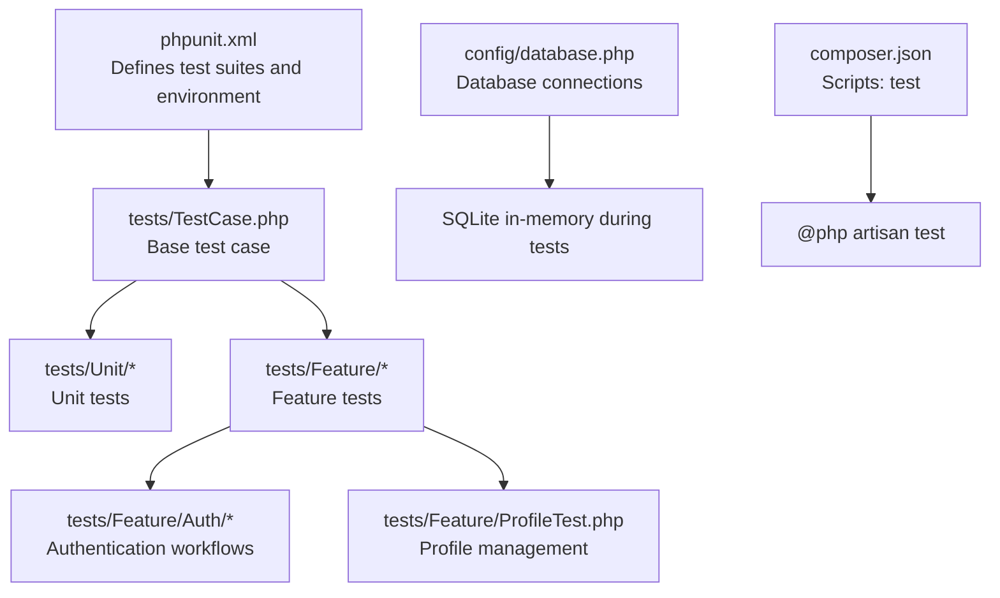
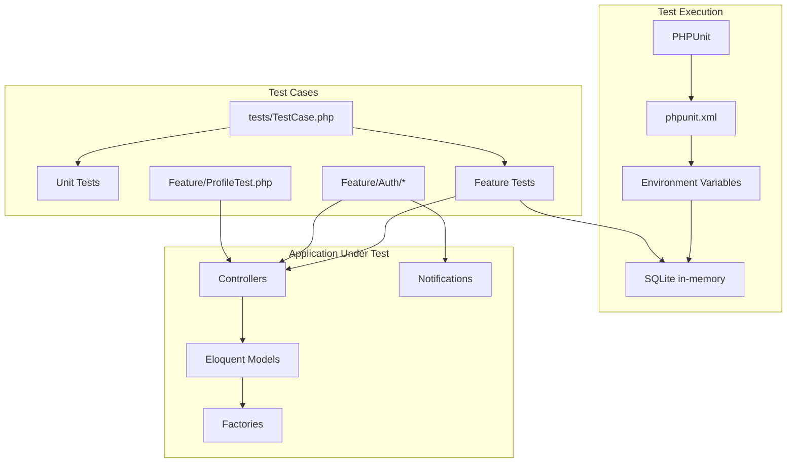
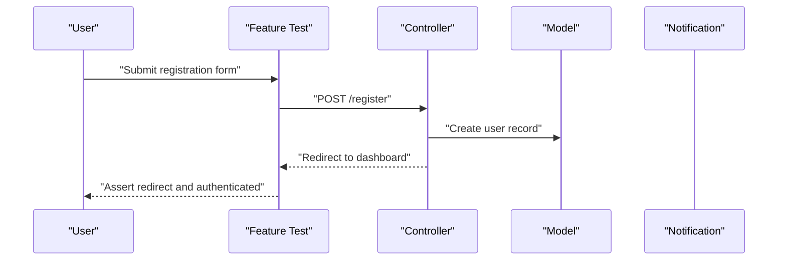
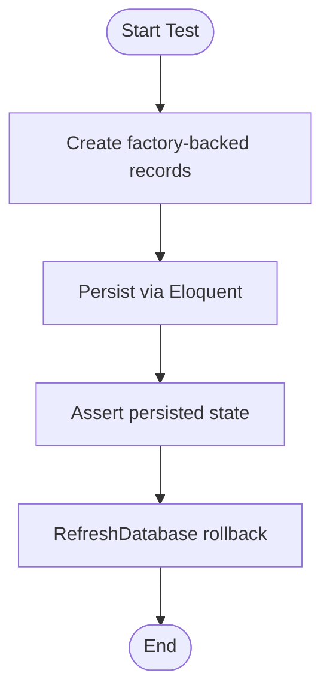
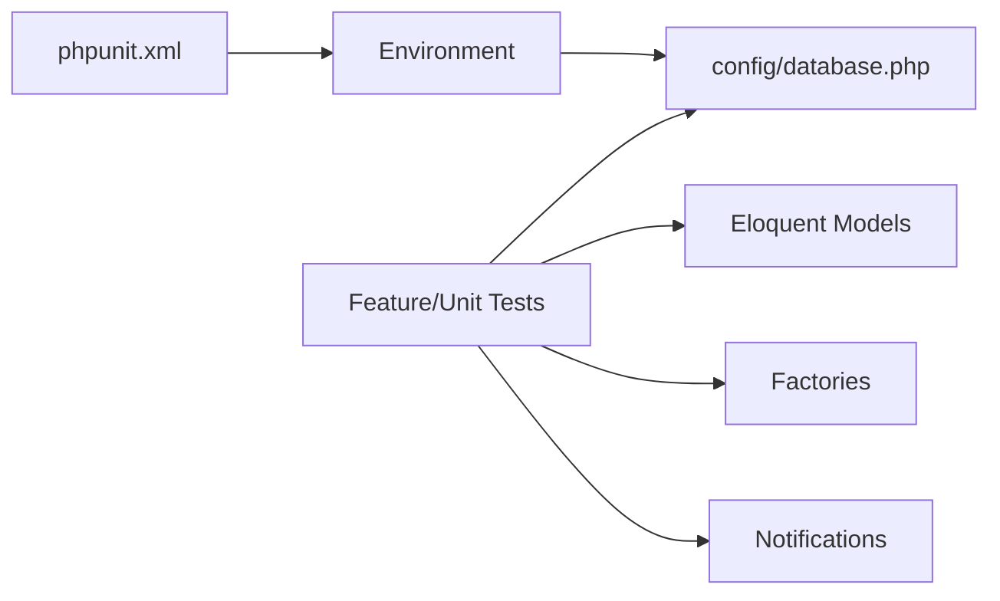

# Testing Strategy

<cite>
**Referenced Files in This Document**
- [phpunit.xml](file://phpunit.xml)
- [composer.json](file://composer.json)
- [TestCase.php](file://tests/TestCase.php)
- [ExampleTest.php (Unit)](file://tests/Unit/ExampleTest.php)
- [ExampleTest.php (Feature)](file://tests/Feature/ExampleTest.php)
- [AuthenticationTest.php](file://tests/Feature/Auth/AuthenticationTest.php)
- [RegistrationTest.php](file://tests/Feature/Auth/RegistrationTest.php)
- [PasswordResetTest.php](file://tests/Feature/Auth/PasswordResetTest.php)
- [ProfileTest.php](file://tests/Feature/ProfileTest.php)
- [database.php](file://config/database.php)
- [User.php](file://app/Models/User.php)
- [UserFactory.php](file://database/factories/UserFactory.php)
- [create_users_table.php](file://database/migrations/0001_01_01_000000_create_users_table.php)
</cite>

## Table of Contents
1. [Introduction](#introduction)
2. [Project Structure](#project-structure)
3. [Core Components](#core-components)
4. [Architecture Overview](#architecture-overview)
5. [Detailed Component Analysis](#detailed-component-analysis)
6. [Dependency Analysis](#dependency-analysis)
7. [Performance Considerations](#performance-considerations)
8. [Security Testing](#security-testing)
9. [Regression Testing](#regression-testing)
10. [Troubleshooting Guide](#troubleshooting-guide)
11. [Conclusion](#conclusion)
12. [Appendices](#appendices)

## Introduction
This document defines a comprehensive testing strategy for ClinicalLog CMS. It covers PHPUnit configuration, test suite organization, unit and feature testing approaches, integration testing patterns, environment setup, database testing strategies, mocking techniques, best practices, continuous integration considerations, and test coverage analysis. It also outlines performance, security, and regression testing procedures, along with practical examples and automated workflows.

## Project Structure
ClinicalLog CMS follows Laravel’s standard testing layout with separate Unit and Feature test suites. PHPUnit configuration defines two test suites and sets environment variables optimized for testing, including an in-memory SQLite database. Composer scripts provide a streamlined test command that clears configuration caches and runs Laravel’s test discovery.

**Diagram sources**
- [phpunit.xml:1-37](file://phpunit.xml#L1-L37)
- [tests/TestCase.php:1-11](file://tests/TestCase.php#L1-L11)
- [composer.json:48-51](file://composer.json#L48-L51)
- [config/database.php:33-45](file://config/database.php#L33-L45)

**Section sources**
- [phpunit.xml:7-19](file://phpunit.xml#L7-L19)
- [composer.json:48-51](file://composer.json#L48-L51)
- [tests/TestCase.php:1-11](file://tests/TestCase.php#L1-L11)

## Core Components
- Test Suites
  - Unit: Isolated tests for pure logic and small units.
  - Feature: End-to-end tests simulating HTTP requests and user workflows.
- Base Test Case: Extends Laravel’s base test case to share common setup.
- Environment Configuration: PHPUnit sets APP_ENV=testing and uses SQLite in-memory database via DB_CONNECTION and DB_DATABASE.
- Factories and Models: Eloquent factories generate realistic test data; models define persistence and casting.

Key implementation references:
- Test suite definitions and environment variables: [phpunit.xml:7-35](file://phpunit.xml#L7-L35)
- Base test case: [tests/TestCase.php:7-10](file://tests/TestCase.php#L7-L10)
- Example unit test: [ExampleTest.php (Unit):12-15](file://tests/Unit/ExampleTest.php#L12-L15)
- Example feature test: [ExampleTest.php (Feature):13-18](file://tests/Feature/ExampleTest.php#L13-L18)
- Database configuration defaults: [database.php:20](file://config/database.php#L20), [database.php:35-45](file://config/database.php#L35-L45)
- User model and attributes: [User.php:13-31](file://app/Models/User.php#L13-L31)
- User factory default state: [UserFactory.php:25-34](file://database/factories/UserFactory.php#L25-L34)

**Section sources**
- [phpunit.xml:7-35](file://phpunit.xml#L7-L35)
- [tests/TestCase.php:7-10](file://tests/TestCase.php#L7-L10)
- [ExampleTest.php (Unit):12-15](file://tests/Unit/ExampleTest.php#L12-L15)
- [ExampleTest.php (Feature):13-18](file://tests/Feature/ExampleTest.php#L13-L18)
- [config/database.php:20](file://config/database.php#L20)
- [config/database.php:35-45](file://config/database.php#L35-L45)
- [User.php:13-31](file://app/Models/User.php#L13-L31)
- [UserFactory.php:25-34](file://database/factories/UserFactory.php#L25-L34)

## Architecture Overview
The testing architecture leverages Laravel’s HTTP kernel for feature tests, Eloquent ORM for persistence, and SQLite in-memory for speed. Factories seed test data, while notifications are faked for predictable outcomes. The base test case centralizes shared behavior.

**Diagram sources**
- [phpunit.xml:7-35](file://phpunit.xml#L7-L35)
- [tests/TestCase.php:7-10](file://tests/TestCase.php#L7-L10)
- [AuthenticationTest.php:20-31](file://tests/Feature/Auth/AuthenticationTest.php#L20-L31)
- [RegistrationTest.php:19-30](file://tests/Feature/Auth/RegistrationTest.php#L19-L30)
- [PasswordResetTest.php:24-31](file://tests/Feature/Auth/PasswordResetTest.php#L24-L31)
- [ProfileTest.php:13-44](file://tests/Feature/ProfileTest.php#L13-L44)
- [UserFactory.php:25-34](file://database/factories/UserFactory.php#L25-L34)
- [User.php:13-31](file://app/Models/User.php#L13-L31)

## Detailed Component Analysis

### PHPUnit Configuration and Environment
- Test Suites: Two top-level suites enable parallel or selective execution.
- Source Coverage: Includes the app directory for coverage analysis.
- Environment:
  - APP_ENV=testing enables testing-specific behavior.
  - CACHE_STORE=array and SESSION_DRIVER=array minimize external dependencies.
  - DB_CONNECTION=sqlite and DB_DATABASE=:memory: provide fast, isolated databases per process.
  - MAIL_MAILER=array captures emails without sending.
  - QUEUE_CONNECTION=sync ensures synchronous job handling.
  - PULSE/TELESCOPE/NIGHTWATCH disabled to reduce overhead.

Recommended adjustments for CI:
- Set explicit database credentials for reporting and artifact collection.
- Add coverage filters to exclude generated files and third-party libraries.

**Section sources**
- [phpunit.xml:7-19](file://phpunit.xml#L7-L19)
- [phpunit.xml:20-35](file://phpunit.xml#L20-L35)

### Base Test Case
- Provides a reusable foundation for all tests.
- Extends Laravel’s base test case to inherit HTTP, database, and notification helpers.

Usage examples:
- Feature tests use RefreshDatabase to reset schema per test.
- Authentication tests assert redirects and session states.

**Section sources**
- [tests/TestCase.php:7-10](file://tests/TestCase.php#L7-L10)
- [AuthenticationTest.php:10-11](file://tests/Feature/Auth/AuthenticationTest.php#L10-L11)
- [ProfileTest.php:9-11](file://tests/Feature/ProfileTest.php#L9-L11)

### Unit Testing Approaches
- Purpose: Validate isolated logic, helpers, and small components.
- Current state: Minimal example included; expand with domain logic tests.
- Best practices:
  - Keep tests deterministic; avoid external I/O.
  - Use data providers for varied inputs.
  - Assert clear outcomes and side effects.

Reference:
- Example unit test: [ExampleTest.php (Unit):12-15](file://tests/Unit/ExampleTest.php#L12-L15)

**Section sources**
- [ExampleTest.php (Unit):12-15](file://tests/Unit/ExampleTest.php#L12-L15)

### Feature Testing for User Workflows
- Authentication
  - Rendering login page, successful login, invalid password handling, logout.
  - Uses RefreshDatabase and actingAs for session state.
  - Reference: [AuthenticationTest.php:13-53](file://tests/Feature/Auth/AuthenticationTest.php#L13-L53)

- Registration
  - Rendering registration page and creating new users.
  - Reference: [RegistrationTest.php:12-30](file://tests/Feature/Auth/RegistrationTest.php#L12-L30)

- Password Reset
  - Requesting reset link, rendering reset page, resetting password.
  - Uses Notification::fake() to assert sent notifications.
  - Reference: [PasswordResetTest.php:22-72](file://tests/Feature/Auth/PasswordResetTest.php#L22-L72)

- Profile Management
  - Viewing profile, updating information, preserving verification status when email unchanged, deleting account with validation.
  - Reference: [ProfileTest.php:13-98](file://tests/Feature/ProfileTest.php#L13-L98)

**Diagram sources**
- [RegistrationTest.php:19-30](file://tests/Feature/Auth/RegistrationTest.php#L19-L30)

**Section sources**
- [AuthenticationTest.php:13-53](file://tests/Feature/Auth/AuthenticationTest.php#L13-L53)
- [RegistrationTest.php:12-30](file://tests/Feature/Auth/RegistrationTest.php#L12-L30)
- [PasswordResetTest.php:22-72](file://tests/Feature/Auth/PasswordResetTest.php#L22-L72)
- [ProfileTest.php:13-98](file://tests/Feature/ProfileTest.php#L13-L98)

### Integration Testing for System Components
- Database Integration
  - SQLite in-memory database configured via environment and Laravel config.
  - RefreshDatabase trait resets schema per test for isolation.
  - References:
    - [phpunit.xml:26-27](file://phpunit.xml#L26-L27)
    - [config/database.php:35-45](file://config/database.php#L35-L45)
    - [create_users_table.php:14-22](file://database/migrations/0001_01_01_000000_create_users_table.php#L14-L22)

- Model Integration
  - User model uses HasFactory and attribute casting; factories produce realistic records.
  - References:
    - [User.php:13-31](file://app/Models/User.php#L13-L31)
    - [UserFactory.php:25-34](file://database/factories/UserFactory.php#L25-L34)

- Notification Integration
  - Fake notifications decouple tests from mailers and external services.
  - Reference: [PasswordResetTest.php:24](file://tests/Feature/Auth/PasswordResetTest.php#L24)

**Diagram sources**
- [AuthenticationTest.php:20-31](file://tests/Feature/Auth/AuthenticationTest.php#L20-L31)
- [UserFactory.php:25-34](file://database/factories/UserFactory.php#L25-L34)
- [create_users_table.php:14-22](file://database/migrations/0001_01_01_000000_create_users_table.php#L14-L22)

**Section sources**
- [phpunit.xml:26-27](file://phpunit.xml#L26-L27)
- [config/database.php:35-45](file://config/database.php#L35-L45)
- [create_users_table.php:14-22](file://database/migrations/0001_01_01_000000_create_users_table.php#L14-L22)
- [User.php:13-31](file://app/Models/User.php#L13-L31)
- [UserFactory.php:25-34](file://database/factories/UserFactory.php#L25-L34)
- [PasswordResetTest.php:24](file://tests/Feature/Auth/PasswordResetTest.php#L24)

### Mocking Techniques
- Notifications: Use Notification::fake() to assert sent notifications without delivery.
  - Reference: [PasswordResetTest.php:24](file://tests/Feature/Auth/PasswordResetTest.php#L24)
- Session and Authentication: Use actingAs() to simulate logged-in users.
  - Reference: [ProfileTest.php:17-19](file://tests/Feature/ProfileTest.php#L17-L19)
- Database: Use RefreshDatabase to reset schema and truncate tables between tests.
  - Reference: [AuthenticationTest.php:11](file://tests/Feature/Auth/AuthenticationTest.php#L11)

**Section sources**
- [PasswordResetTest.php:24](file://tests/Feature/Auth/PasswordResetTest.php#L24)
- [ProfileTest.php:17-19](file://tests/Feature/ProfileTest.php#L17-L19)
- [AuthenticationTest.php:11](file://tests/Feature/Auth/AuthenticationTest.php#L11)

### Test Data Management
- Factories: Provide default, verified, and unverified user states.
  - Reference: [UserFactory.php:25-44](file://database/factories/UserFactory.php#L25-L44)
- Fixtures: Use minimal, deterministic seeds for repeatable scenarios.
- Environment isolation: SQLite in-memory database prevents cross-test contamination.

**Section sources**
- [UserFactory.php:25-44](file://database/factories/UserFactory.php#L25-L44)
- [phpunit.xml:26-27](file://phpunit.xml#L26-L27)

### Automated Testing Workflows
- Local development: Composer script runs Laravel’s test discovery after clearing config cache.
  - Reference: [composer.json:48-51](file://composer.json#L48-L51)
- CI pipeline recommendations:
  - Install dependencies, prepare database, run tests, collect coverage, and artifacts.
  - Use separate jobs for Unit and Feature tests.

**Section sources**
- [composer.json:48-51](file://composer.json#L48-L51)

## Dependency Analysis
- PHPUnit depends on Laravel’s testing helpers and environment variables set in phpunit.xml.
- Feature tests depend on controllers, models, and notifications; factories supply test data.
- Database connectivity depends on config/database.php and environment variables.

**Diagram sources**
- [phpunit.xml:7-35](file://phpunit.xml#L7-L35)
- [config/database.php:35-45](file://config/database.php#L35-L45)
- [User.php:13-31](file://app/Models/User.php#L13-L31)
- [UserFactory.php:25-34](file://database/factories/UserFactory.php#L25-L34)

**Section sources**
- [phpunit.xml:7-35](file://phpunit.xml#L7-L35)
- [config/database.php:35-45](file://config/database.php#L35-L45)
- [User.php:13-31](file://app/Models/User.php#L13-L31)
- [UserFactory.php:25-34](file://database/factories/UserFactory.php#L25-L34)

## Performance Considerations
- Database speed: SQLite in-memory reduces latency; keep migrations minimal and use RefreshDatabase judiciously.
- Concurrency: Separate Unit and Feature suites to parallelize execution.
- Caching: Disable cache and session persistence in tests to avoid cross-test interference.
- Coverage: Exclude third-party and generated files to reduce analysis overhead.

[No sources needed since this section provides general guidance]

## Security Testing
- Input validation: Add tests for CSRF protection, XSS prevention, and authorization checks.
- Authentication: Verify unauthorized access attempts fail and protected routes redirect appropriately.
- Password handling: Ensure hashing and verification logic is covered by tests.
- Notifications: Validate tokens and URLs are handled securely in password reset flows.

[No sources needed since this section provides general guidance]

## Regression Testing
- Maintain a comprehensive Feature suite covering critical user journeys.
- Use deterministic factories and snapshots for UI regressions.
- Automate nightly runs against multiple database drivers to detect compatibility issues.

[No sources needed since this section provides general guidance]

## Troubleshooting Guide
- Database errors: Ensure migrations are applied before running tests; verify DB_CONNECTION and DB_DATABASE environment variables.
  - References: [phpunit.xml:26-27](file://phpunit.xml#L26-L27), [config/database.php:35-45](file://config/database.php#L35-L45)
- Authentication failures: Confirm actingAs usage and route names for redirects.
  - Reference: [ProfileTest.php:30-37](file://tests/Feature/ProfileTest.php#L30-L37)
- Notification assertions: Use Notification::fake() before asserting sent notifications.
  - Reference: [PasswordResetTest.php:24](file://tests/Feature/Auth/PasswordResetTest.php#L24)

**Section sources**
- [phpunit.xml:26-27](file://phpunit.xml#L26-L27)
- [config/database.php:35-45](file://config/database.php#L35-L45)
- [ProfileTest.php:30-37](file://tests/Feature/ProfileTest.php#L30-L37)
- [PasswordResetTest.php:24](file://tests/Feature/Auth/PasswordResetTest.php#L24)

## Conclusion
ClinicalLog CMS employs a solid foundation for testing with PHPUnit, Laravel’s testing traits, and SQLite in-memory databases. By expanding unit tests, enriching feature coverage, adopting mocking strategies, and integrating CI pipelines, the project can achieve robust quality assurance. Focus on test data hygiene, performance, security, and regression coverage to sustain long-term maintainability.

[No sources needed since this section summarizes without analyzing specific files]

## Appendices

### Writing Effective Tests
- Clarity: Use descriptive method names and comments.
- Isolation: Prefer Fresh/RefreshDatabase per test; avoid global state.
- Assertions: Assert both success and failure paths; include negative cases.
- Examples:
  - Authentication: [AuthenticationTest.php:20-31](file://tests/Feature/Auth/AuthenticationTest.php#L20-L31)
  - Registration: [RegistrationTest.php:19-30](file://tests/Feature/Auth/RegistrationTest.php#L19-L30)
  - Password reset: [PasswordResetTest.php:50-72](file://tests/Feature/Auth/PasswordResetTest.php#L50-L72)
  - Profile updates: [ProfileTest.php:24-44](file://tests/Feature/ProfileTest.php#L24-L44)

**Section sources**
- [AuthenticationTest.php:20-31](file://tests/Feature/Auth/AuthenticationTest.php#L20-L31)
- [RegistrationTest.php:19-30](file://tests/Feature/Auth/RegistrationTest.php#L19-L30)
- [PasswordResetTest.php:50-72](file://tests/Feature/Auth/PasswordResetTest.php#L50-L72)
- [ProfileTest.php:24-44](file://tests/Feature/ProfileTest.php#L24-L44)