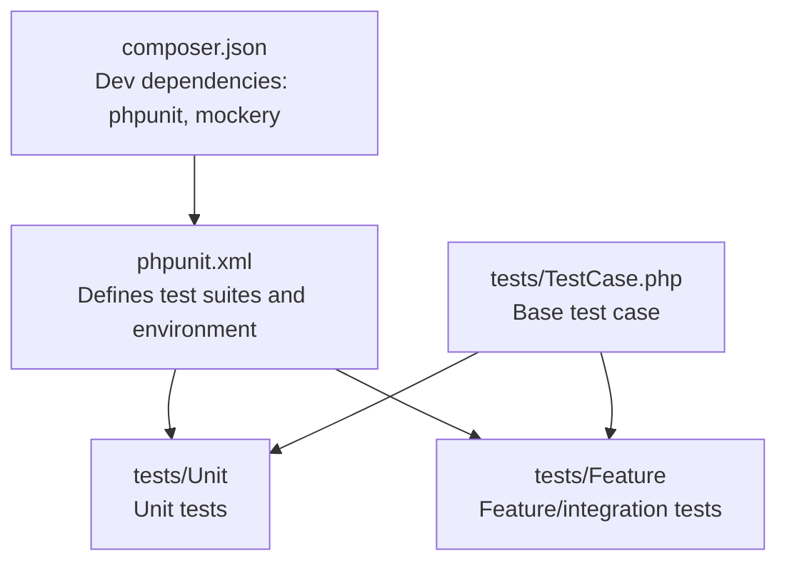
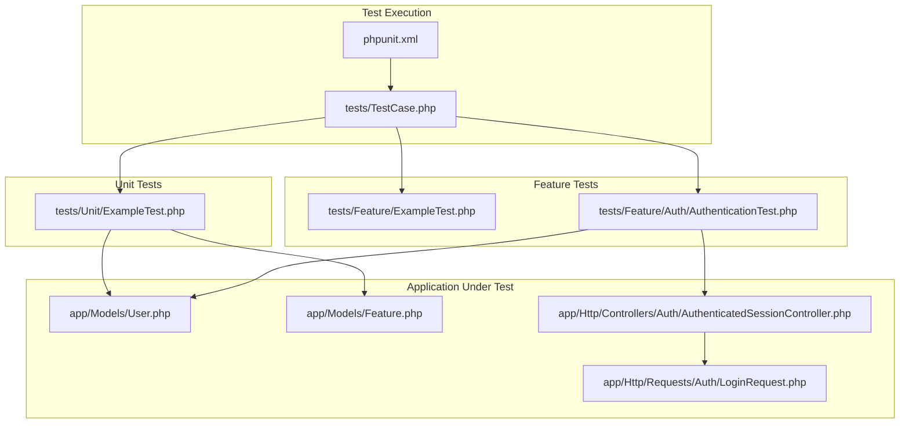
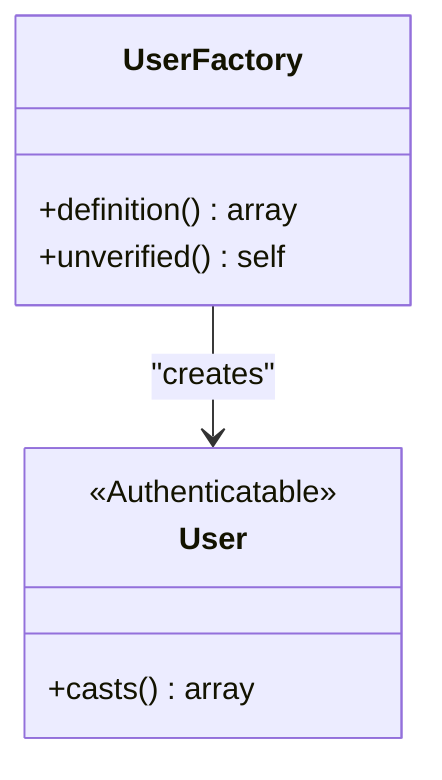
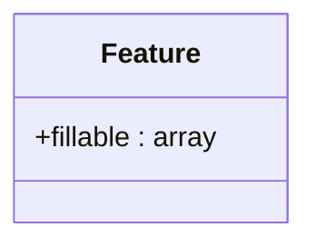
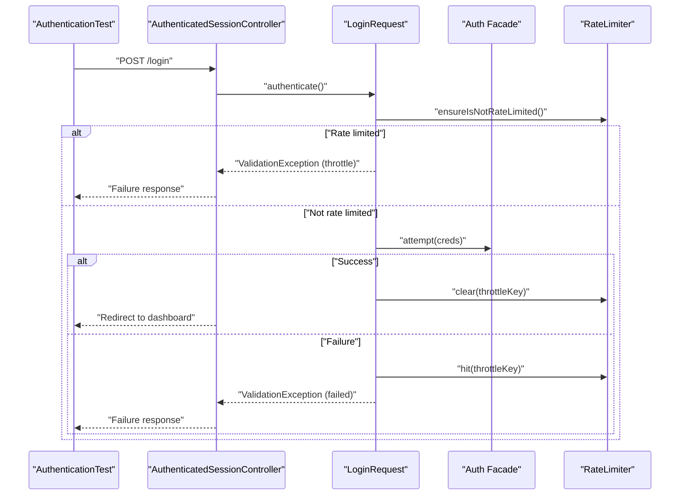
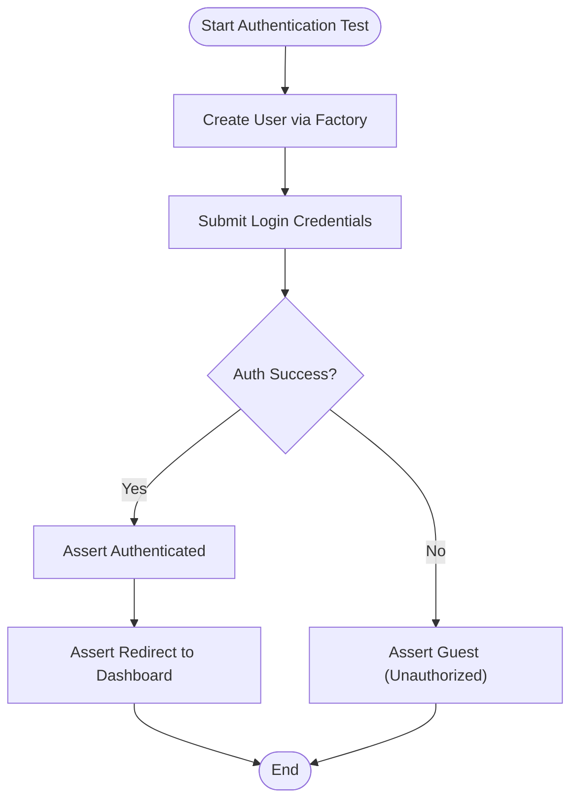
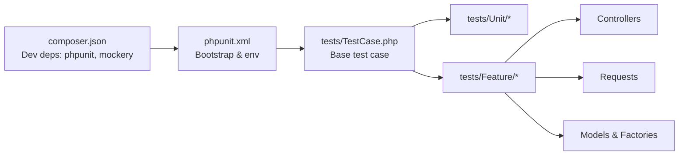

# Unit Testing

<cite>
**Referenced Files in This Document**
- [phpunit.xml](file://phpunit.xml)
- [composer.json](file://composer.json)
- [tests/TestCase.php](file://tests/TestCase.php)
- [tests/Unit/ExampleTest.php](file://tests/Unit/ExampleTest.php)
- [tests/Feature/ExampleTest.php](file://tests/Feature/ExampleTest.php)
- [tests/Feature/Auth/AuthenticationTest.php](file://tests/Feature/Auth/AuthenticationTest.php)
- [app/Models/User.php](file://app/Models/User.php)
- [app/Models/Feature.php](file://app/Models/Feature.php)
- [database/factories/UserFactory.php](file://database/factories/UserFactory.php)
- [database/migrations/0001_01_01_000000_create_users_table.php](file://database/migrations/0001_01_01_000000_create_users_table.php)
- [app/Http/Controllers/Auth/AuthenticatedSessionController.php](file://app/Http/Controllers/Auth/AuthenticatedSessionController.php)
- [app/Http/Requests/Auth/LoginRequest.php](file://app/Http/Requests/Auth/LoginRequest.php)
</cite>

## Table of Contents
1. [Introduction](#introduction)
2. [Project Structure](#project-structure)
3. [Core Components](#core-components)
4. [Architecture Overview](#architecture-overview)
5. [Detailed Component Analysis](#detailed-component-analysis)
6. [Dependency Analysis](#dependency-analysis)
7. [Performance Considerations](#performance-considerations)
8. [Troubleshooting Guide](#troubleshooting-guide)
9. [Conclusion](#conclusion)
10. [Appendices](#appendices)

## Introduction
This document explains how unit and feature testing are set up and organized in ClinicalLog CMS. It focuses on PHPUnit configuration, test suite organization, and practical testing patterns for models, validation logic, and business rules. It also covers isolation techniques, mocking strategies, assertion strategies, and best practices for writing maintainable tests. The guidance references concrete files in the repository to ensure accuracy and reproducibility.

## Project Structure
The testing setup is organized into two primary suites:
- Unit tests: Located under tests/Unit and intended for isolated logic tests (e.g., pure functions, small units of logic).
- Feature tests: Located under tests/Feature and intended for integration-like tests that exercise HTTP requests, middleware, and controller flows.

PHPUnit is configured via phpunit.xml to load the Composer autoloader, define test suites, and set environment variables optimized for testing (e.g., SQLite in-memory database, array caches, and reduced bcrypt cost for speed).

**Diagram sources**
- [phpunit.xml:1-37](file://phpunit.xml#L1-L37)
- [composer.json:13-22](file://composer.json#L13-L22)
- [tests/TestCase.php:1-11](file://tests/TestCase.php#L1-L11)

**Section sources**
- [phpunit.xml:1-37](file://phpunit.xml#L1-L37)
- [composer.json:13-22](file://composer.json#L13-L22)
- [tests/TestCase.php:1-11](file://tests/TestCase.php#L1-L11)

## Core Components
- PHPUnit configuration and environment:
  - Test suites: Unit and Feature.
  - Environment overrides for fast, deterministic runs (SQLite in-memory, array cache, reduced bcrypt cost).
- Base test case:
  - An abstract base class extending Laravel’s base test case, enabling shared behavior across tests.
- Example tests:
  - A minimal unit test and a basic feature test demonstrate the structure and assertions used in this project.

Practical implications:
- Use RefreshDatabase trait in feature tests that require database state isolation.
- Leverage factories to create realistic model instances quickly.
- Keep unit tests free of external dependencies (database, cache, mail) by mocking or stubbing.

**Section sources**
- [phpunit.xml:7-35](file://phpunit.xml#L7-L35)
- [tests/TestCase.php:7-10](file://tests/TestCase.php#L7-L10)
- [tests/Unit/ExampleTest.php:1-17](file://tests/Unit/ExampleTest.php#L1-L17)
- [tests/Feature/ExampleTest.php:1-20](file://tests/Feature/ExampleTest.php#L1-L20)

## Architecture Overview
The testing architecture separates concerns between unit and feature tests, with environment configuration supporting rapid feedback loops. Feature tests commonly exercise controllers and requests that trigger validation logic, while unit tests focus on isolated logic.

**Diagram sources**
- [phpunit.xml:1-37](file://phpunit.xml#L1-L37)
- [tests/TestCase.php:1-11](file://tests/TestCase.php#L1-L11)
- [tests/Unit/ExampleTest.php:1-17](file://tests/Unit/ExampleTest.php#L1-L17)
- [tests/Feature/ExampleTest.php:1-20](file://tests/Feature/ExampleTest.php#L1-L20)
- [tests/Feature/Auth/AuthenticationTest.php:1-55](file://tests/Feature/Auth/AuthenticationTest.php#L1-L55)
- [app/Models/User.php:1-33](file://app/Models/User.php#L1-L33)
- [app/Models/Feature.php:1-17](file://app/Models/Feature.php#L1-L17)
- [app/Http/Controllers/Auth/AuthenticatedSessionController.php:1-48](file://app/Http/Controllers/Auth/AuthenticatedSessionController.php#L1-L48)
- [app/Http/Requests/Auth/LoginRequest.php:1-87](file://app/Http/Requests/Auth/LoginRequest.php#L1-L87)

## Detailed Component Analysis

### PHPUnit Setup and Test Suites
- Test suites:
  - Unit: tests/Unit
  - Feature: tests/Feature
- Environment:
  - SQLite in-memory database for speed and isolation.
  - Array cache, array mailer, and sync queue drivers to avoid external side effects.
  - Reduced bcrypt cost to accelerate hashing during tests.
- Dev dependencies:
  - PHPUnit and Mockery are declared in composer.json, enabling expressive mocks and assertions.

Best practices:
- Run unit tests independently for fast feedback.
- Use RefreshDatabase in feature tests that rely on database state.
- Keep environment-specific settings in phpunit.xml to ensure reproducible runs.

**Section sources**
- [phpunit.xml:7-35](file://phpunit.xml#L7-L35)
- [composer.json:13-22](file://composer.json#L13-L22)

### Base Test Case and Naming Conventions
- tests/TestCase.php extends Laravel’s base test case, providing a foundation for all tests.
- Naming conventions observed:
  - Feature tests often include descriptive names like AuthenticationTest.
  - Methods use imperative style (e.g., test_login_screen_can_be_rendered) to clearly describe behavior.

Recommendations:
- Keep test class names descriptive and aligned with the feature or component under test.
- Use method names that read like executable documentation (e.g., testXyzCanDoY).

**Section sources**
- [tests/TestCase.php:7-10](file://tests/TestCase.php#L7-L10)
- [tests/Feature/Auth/AuthenticationTest.php:9-55](file://tests/Feature/Auth/AuthenticationTest.php#L9-L55)

### Testing Patterns for Models

#### User Model
- Attributes and casting:
  - Fillable and hidden attributes are defined declaratively.
  - Passwords are hashed via the model’s cast configuration.
- Factories:
  - database/factories/UserFactory.php provides realistic default states and supports variations (e.g., unverified emails).
- Testing approach:
  - Unit tests can assert model casting and attribute behavior without hitting the database.
  - Feature tests can create users via factories and verify persistence and retrieval.

**Diagram sources**
- [app/Models/User.php:13-31](file://app/Models/User.php#L13-L31)
- [database/factories/UserFactory.php:25-44](file://database/factories/UserFactory.php#L25-L44)

**Section sources**
- [app/Models/User.php:13-31](file://app/Models/User.php#L13-L31)
- [database/factories/UserFactory.php:25-44](file://database/factories/UserFactory.php#L25-L44)

#### Feature Model
- Fillable attributes include title, description, icon identifiers, and sort order.
- Testing approach:
  - Use factories or direct attribute assignment to validate creation and updates.
  - Assert fillable attributes and enforce guarded restrictions in unit tests.

**Diagram sources**
- [app/Models/Feature.php:9-15](file://app/Models/Feature.php#L9-L15)

**Section sources**
- [app/Models/Feature.php:9-15](file://app/Models/Feature.php#L9-L15)

### Testing Validation Logic and Business Rules

#### Login Request Validation and Throttling
- Validation rules:
  - Email and password are required and of specific types.
- Authentication flow:
  - authenticate() attempts login, clears rate limiter on success, hits it on failure.
  - ensureIsNotRateLimited() enforces throttling and throws a validation exception with localized messages.
- Controller integration:
  - AuthenticatedSessionController::store delegates to LoginRequest::authenticate and regenerates the session.

**Diagram sources**
- [tests/Feature/Auth/AuthenticationTest.php:20-31](file://tests/Feature/Auth/AuthenticationTest.php#L20-L31)
- [app/Http/Controllers/Auth/AuthenticatedSessionController.php:25-32](file://app/Http/Controllers/Auth/AuthenticatedSessionController.php#L25-L32)
- [app/Http/Requests/Auth/LoginRequest.php:41-54](file://app/Http/Requests/Auth/LoginRequest.php#L41-L54)
- [app/Http/Requests/Auth/LoginRequest.php:61-77](file://app/Http/Requests/Auth/LoginRequest.php#L61-L77)

**Section sources**
- [app/Http/Requests/Auth/LoginRequest.php:28-54](file://app/Http/Requests/Auth/LoginRequest.php#L28-L54)
- [app/Http/Requests/Auth/LoginRequest.php:61-85](file://app/Http/Requests/Auth/LoginRequest.php#L61-L85)
- [app/Http/Controllers/Auth/AuthenticatedSessionController.php:25-32](file://app/Http/Controllers/Auth/AuthenticatedSessionController.php#L25-L32)
- [tests/Feature/Auth/AuthenticationTest.php:20-31](file://tests/Feature/Auth/AuthenticationTest.php#L20-L31)

### Test Isolation Techniques and Mocking Dependencies
- Database isolation:
  - Use RefreshDatabase trait in feature tests to rollback or re-seed after each test.
- Environment isolation:
  - phpunit.xml sets APP_ENV=testing and disables external services (cache, mail, queues) to keep tests deterministic.
- Mocking:
  - Composer dev dependency includes mockery; use it to mock interfaces or collaborators in unit tests.
- Assertions:
  - Feature tests commonly assert HTTP status codes and redirects.
  - Unit tests assert model behavior, casting, and computed outcomes.

Guidelines:
- Prefer factories for model creation in tests.
- Avoid real network calls; mock HTTP clients or third-party integrations.
- Keep unit tests focused on pure logic; defer integration concerns to feature tests.

**Section sources**
- [phpunit.xml:20-35](file://phpunit.xml#L20-L35)
- [composer.json:19-19](file://composer.json#L19-L19)
- [tests/Feature/Auth/AuthenticationTest.php:11-11](file://tests/Feature/Auth/AuthenticationTest.php#L11-L11)

### Assertion Strategies and Edge Cases
- HTTP-level assertions:
  - Verify successful responses, redirects, and error responses.
- Authentication assertions:
  - assertAuthenticated(), assertGuest() to verify guard state.
- Validation assertions:
  - Assert presence of validation errors for invalid inputs.
- Edge cases:
  - Throttling scenarios (too many attempts).
  - Unverified email addresses via factory variants.
  - Empty or malformed inputs for request validation.

Examples to implement:
- Test login with missing fields to trigger validation failures.
- Simulate rate limiting by exhausting attempts and asserting lockout messages.
- Test logout flow and redirection behavior.

**Section sources**
- [tests/Feature/Auth/AuthenticationTest.php:13-18](file://tests/Feature/Auth/AuthenticationTest.php#L13-L18)
- [tests/Feature/Auth/AuthenticationTest.php:33-43](file://tests/Feature/Auth/AuthenticationTest.php#L33-L43)
- [tests/Feature/Auth/AuthenticationTest.php:45-53](file://tests/Feature/Auth/AuthenticationTest.php#L45-L53)
- [app/Http/Requests/Auth/LoginRequest.php:61-77](file://app/Http/Requests/Auth/LoginRequest.php#L61-L77)
- [database/factories/UserFactory.php:39-44](file://database/factories/UserFactory.php#L39-L44)

### Examples of Testing Approaches

#### Unit Testing Example
- tests/Unit/ExampleTest.php demonstrates a minimal unit test that asserts a basic condition.
- Recommended extensions:
  - Add tests for model casting and attribute behavior.
  - Add tests for small utility functions or computed properties.

**Section sources**
- [tests/Unit/ExampleTest.php:12-15](file://tests/Unit/ExampleTest.php#L12-L15)

#### Feature Testing Example
- tests/Feature/ExampleTest.php shows a simple GET request and status assertion.
- Recommended extensions:
  - Add route tests for authenticated flows.
  - Integrate with factories to test model creation and retrieval.

**Section sources**
- [tests/Feature/ExampleTest.php:13-18](file://tests/Feature/ExampleTest.php#L13-L18)

#### Authentication Feature Test
- tests/Feature/Auth/AuthenticationTest.php:
  - Renders login screen.
  - Authenticates valid users and verifies redirect.
  - Prevents authentication with invalid passwords.
  - Verifies logout behavior.

**Diagram sources**
- [tests/Feature/Auth/AuthenticationTest.php:20-31](file://tests/Feature/Auth/AuthenticationTest.php#L20-L31)
- [tests/Feature/Auth/AuthenticationTest.php:33-43](file://tests/Feature/Auth/AuthenticationTest.php#L33-L43)
- [tests/Feature/Auth/AuthenticationTest.php:45-53](file://tests/Feature/Auth/AuthenticationTest.php#L45-L53)

**Section sources**
- [tests/Feature/Auth/AuthenticationTest.php:13-53](file://tests/Feature/Auth/AuthenticationTest.php#L13-L53)

## Dependency Analysis
- PHPUnit and Laravel base test case:
  - phpunit.xml loads the Composer autoloader and defines test suites.
  - tests/TestCase.php extends Laravel’s base test case.
- Dev dependencies:
  - composer.json declares phpunit and mockery for testing.
- Application dependencies in tests:
  - Feature tests depend on controllers and requests that validate business logic.
  - Models and factories are used to construct realistic test data.

**Diagram sources**
- [composer.json:13-22](file://composer.json#L13-L22)
- [phpunit.xml:4-6](file://phpunit.xml#L4-L6)
- [tests/TestCase.php:5-10](file://tests/TestCase.php#L5-L10)

**Section sources**
- [composer.json:13-22](file://composer.json#L13-L22)
- [phpunit.xml:4-6](file://phpunit.xml#L4-L6)
- [tests/TestCase.php:5-10](file://tests/TestCase.php#L5-L10)

## Performance Considerations
- Use SQLite in-memory database for tests to avoid disk I/O overhead.
- Keep bcrypt rounds low in testing environments to reduce CPU cost.
- Prefer unit tests for logic-heavy computations; reserve feature tests for integration checks.
- Avoid unnecessary database writes by using factories and model attributes directly in unit tests.

[No sources needed since this section provides general guidance]

## Troubleshooting Guide
Common issues and resolutions:
- Database state bleeding between tests:
  - Use RefreshDatabase in feature tests that modify data.
- Slow tests due to hashing:
  - Ensure BCRYPT_ROUNDS is set appropriately in phpunit.xml.
- External service interference:
  - Confirm cache, mail, and queue drivers are set to array/sync in phpunit.xml.
- Validation exceptions:
  - When testing LoginRequest, ensure inputs match validation rules or expect ValidationException.

**Section sources**
- [phpunit.xml:20-35](file://phpunit.xml#L20-L35)
- [tests/Feature/Auth/AuthenticationTest.php:11-11](file://tests/Feature/Auth/AuthenticationTest.php#L11-L11)

## Conclusion
ClinicalLog CMS provides a solid foundation for unit and feature testing with clear separation of concerns, environment configuration for reliability, and practical examples. By leveraging factories, traits like RefreshDatabase, and PHPUnit/Mockery, teams can write maintainable, fast, and robust tests. Focus unit tests on isolated logic, and reserve feature tests for integration points like controllers and request validation.

[No sources needed since this section summarizes without analyzing specific files]

## Appendices

### Appendix A: Environment Variables for Testing
- APP_ENV: testing
- CACHE_STORE: array
- DB_CONNECTION: sqlite
- DB_DATABASE: :memory:
- MAIL_MAILER: array
- QUEUE_CONNECTION: sync
- SESSION_DRIVER: array
- BCRYPT_ROUNDS: 4

**Section sources**
- [phpunit.xml:20-35](file://phpunit.xml#L20-L35)

### Appendix B: Database Schema Notes for Testing
- Users table includes standard authentication fields and timestamps.
- Use factories to create users and verify persistence and retrieval in tests.

**Section sources**
- [database/migrations/0001_01_01_000000_create_users_table.php:14-22](file://database/migrations/0001_01_01_000000_create_users_table.php#L14-L22)
- [database/factories/UserFactory.php:25-34](file://database/factories/UserFactory.php#L25-L34)