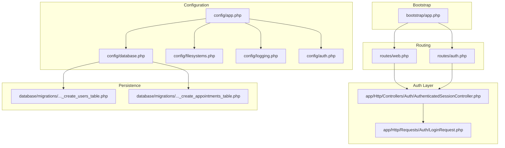
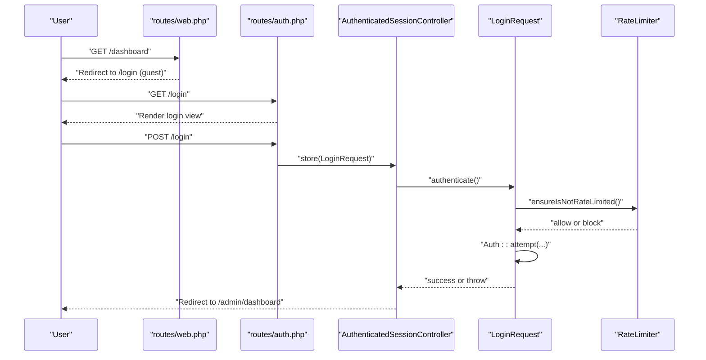
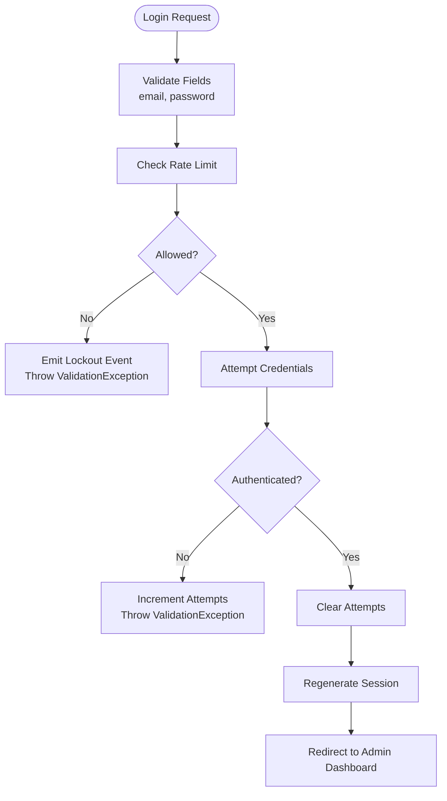
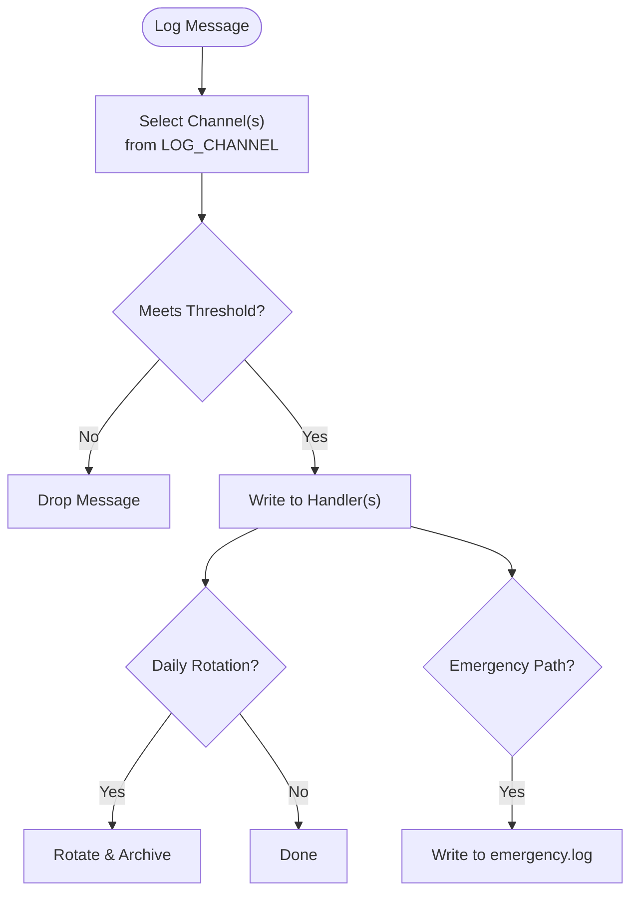
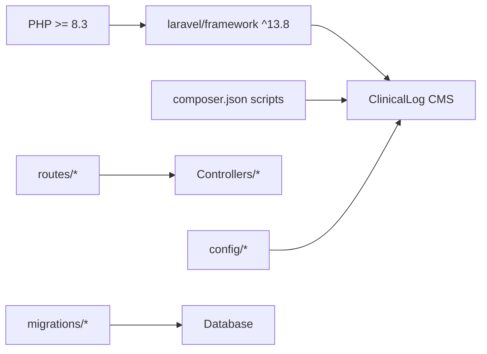

# Troubleshooting & FAQ

<cite>
**Referenced Files in This Document**
- [app.php](file://bootstrap/app.php)
- [web.php](file://routes/web.php)
- [auth.php](file://routes/auth.php)
- [app.php](file://config/app.php)
- [database.php](file://config/database.php)
- [filesystems.php](file://config/filesystems.php)
- [logging.php](file://config/logging.php)
- [auth.php](file://config/auth.php)
- [composer.json](file://composer.json)
- [AuthenticatedSessionController.php](file://app/Http/Controllers/Auth/AuthenticatedSessionController.php)
- [LoginRequest.php](file://app/Http/Requests/Auth/LoginRequest.php)
- [0001_01_01_000000_create_users_table.php](file://database/migrations/0001_01_01_000000_create_users_table.php)
- [2026_06_22_024652_create_appointments_table.php](file://database/migrations/2026_06_22_024652_create_appointments_table.php)
- [README.md](file://README.md)
</cite>

## Table of Contents
1. [Introduction](#introduction)
2. [Project Structure](#project-structure)
3. [Core Components](#core-components)
4. [Architecture Overview](#architecture-overview)
5. [Detailed Component Analysis](#detailed-component-analysis)
6. [Dependency Analysis](#dependency-analysis)
7. [Performance Considerations](#performance-considerations)
8. [Troubleshooting Guide](#troubleshooting-guide)
9. [FAQ](#faq)
10. [Conclusion](#conclusion)
11. [Appendices](#appendices)

## Introduction
This document provides a comprehensive troubleshooting and FAQ guide for ClinicalLog CMS. It focuses on diagnosing and resolving common installation issues, configuration problems, and runtime errors. It also covers debugging techniques, log analysis, error diagnosis, authentication and database connectivity pitfalls, file permission concerns, and operational best practices. The content is grounded in the repository’s configuration, routing, controllers, and migration files to ensure accurate and actionable guidance.

## Project Structure
ClinicalLog CMS follows a standard Laravel application layout with modular routing, configuration-driven behavior, and Eloquent-backed persistence. Key areas relevant to troubleshooting include:
- Bootstrap and routing orchestration
- Configuration for application, database, filesystems, logging, and authentication
- Authentication flow and rate-limiting logic
- Database migrations for users, sessions, password resets, and appointments



**Diagram sources**
- [app.php:8-24](file://bootstrap/app.php#L8-L24)
- [web.php:1-77](file://routes/web.php#L1-L77)
- [auth.php:1-60](file://routes/auth.php#L1-L60)
- [app.php:1-127](file://config/app.php#L1-L127)
- [database.php:1-185](file://config/database.php#L1-L185)
- [filesystems.php:1-81](file://config/filesystems.php#L1-L81)
- [logging.php:1-133](file://config/logging.php#L1-L133)
- [auth.php:1-118](file://config/auth.php#L1-L118)
- [AuthenticatedSessionController.php:1-48](file://app/Http/Controllers/Auth/AuthenticatedSessionController.php#L1-L48)
- [LoginRequest.php:1-87](file://app/Http/Requests/Auth/LoginRequest.php#L1-L87)
- [0001_01_01_000000_create_users_table.php:1-50](file://database/migrations/0001_01_01_000000_create_users_table.php#L1-L50)
- [2026_06_22_024652_create_appointments_table.php:1-36](file://database/migrations/2026_06_22_024652_create_appointments_table.php#L1-L36)

**Section sources**
- [app.php:8-24](file://bootstrap/app.php#L8-L24)
- [web.php:1-77](file://routes/web.php#L1-L77)
- [auth.php:1-60](file://routes/auth.php#L1-L60)
- [app.php:1-127](file://config/app.php#L1-L127)
- [database.php:1-185](file://config/database.php#L1-L185)
- [filesystems.php:1-81](file://config/filesystems.php#L1-L81)
- [logging.php:1-133](file://config/logging.php#L1-L133)
- [auth.php:1-118](file://config/auth.php#L1-L118)
- [AuthenticatedSessionController.php:1-48](file://app/Http/Controllers/Auth/AuthenticatedSessionController.php#L1-L48)
- [LoginRequest.php:1-87](file://app/Http/Requests/Auth/LoginRequest.php#L1-L87)
- [0001_01_01_000000_create_users_table.php:1-50](file://database/migrations/0001_01_01_000000_create_users_table.php#L1-L50)
- [2026_06_22_024652_create_appointments_table.php:1-36](file://database/migrations/2026_06_22_024652_create_appointments_table.php#L1-L36)

## Core Components
- Bootstrap and Routing: The application bootstraps routing and middleware, redirects guests and authenticated users appropriately, and sets JSON rendering for API requests.
- Authentication: Session-based guard with Eloquent provider, rate limiting, and lockout events during failed attempts.
- Database: SQLite by default with optional MySQL/MariaDB/PostgreSQL/SQL Server drivers; migrations define users, sessions, password reset tokens, and appointments.
- Logging: Stack-based logging with configurable channels and levels; daily rotation and emergency fallback.
- Filesystems: Local disks for private/public storage with symlink support for public storage.
- Scripts: Composer scripts automate setup, dev server, queue listener, and log tailing.

**Section sources**
- [app.php:8-24](file://bootstrap/app.php#L8-L24)
- [auth.php:1-118](file://config/auth.php#L1-L118)
- [database.php:1-185](file://config/database.php#L1-L185)
- [logging.php:1-133](file://config/logging.php#L1-L133)
- [filesystems.php:1-81](file://config/filesystems.php#L1-L81)
- [composer.json:35-69](file://composer.json#L35-L69)

## Architecture Overview
The runtime flow for authentication and protected routes is orchestrated through routing groups and middleware redirections. Authentication requests are handled by dedicated controllers and validated via form requests with integrated rate limiting.



**Diagram sources**
- [web.php:33-35](file://routes/web.php#L33-L35)
- [auth.php:14-36](file://routes/auth.php#L14-L36)
- [AuthenticatedSessionController.php:25-32](file://app/Http/Controllers/Auth/AuthenticatedSessionController.php#L25-L32)
- [LoginRequest.php:41-77](file://app/Http/Requests/Auth/LoginRequest.php#L41-L77)

## Detailed Component Analysis

### Authentication Flow and Error Handling
- Controller responsibilities:
  - Render login view and handle logout.
  - Regenerate session after successful login.
- Request validation and throttling:
  - Validates presence of email and password.
  - Enforces rate limits per IP and email.
  - Emits lockout events and throws validation exceptions with localized messages.
- Guard and provider:
  - Session guard with Eloquent provider for users.
  - Password reset broker configuration and timeouts.



**Diagram sources**
- [LoginRequest.php:28-77](file://app/Http/Requests/Auth/LoginRequest.php#L28-L77)
- [AuthenticatedSessionController.php:25-32](file://app/Http/Controllers/Auth/AuthenticatedSessionController.php#L25-L32)
- [auth.php:18-116](file://config/auth.php#L18-L116)

**Section sources**
- [AuthenticatedSessionController.php:1-48](file://app/Http/Controllers/Auth/AuthenticatedSessionController.php#L1-L48)
- [LoginRequest.php:1-87](file://app/Http/Requests/Auth/LoginRequest.php#L1-L87)
- [auth.php:1-118](file://config/auth.php#L1-L118)

### Database Connectivity and Migrations
- Default connection is SQLite; other drivers supported via environment variables.
- Migrations define:
  - Users table with unique email, timestamps, and remember tokens.
  - Sessions table for session management.
  - Password reset tokens table.
  - Appointments table with status and timestamps.

```mermaid
erDiagram
USERS {
bigint id PK
string name
string email UK
timestamp email_verified_at
string password
string rememberToken
timestamps created_at, updated_at
}
PASSWORD_RESET_TOKENS {
string email PK
string token
timestamp created_at
}
SESSIONS {
string id PK
bigint user_id FK
string ip_address
text user_agent
longText payload
int last_activity
}
APPOINTMENTS {
bigint id PK
string name
string email
string whatsapp
string institution
date demo_date
time demo_time
text notes
string status
timestamps created_at, updated_at
}
USERS ||--o{ SESSIONS : "has"
```

**Diagram sources**
- [0001_01_01_000000_create_users_table.php:14-37](file://database/migrations/0001_01_01_000000_create_users_table.php#L14-L37)
- [2026_06_22_024652_create_appointments_table.php:14-25](file://database/migrations/2026_06_22_024652_create_appointments_table.php#L14-L25)

**Section sources**
- [database.php:20-117](file://config/database.php#L20-L117)
- [0001_01_01_000000_create_users_table.php:1-50](file://database/migrations/0001_01_01_000000_create_users_table.php#L1-L50)
- [2026_06_22_024652_create_appointments_table.php:1-36](file://database/migrations/2026_06_22_024652_create_appointments_table.php#L1-L36)

### Logging and Diagnostics
- Default channel is stack; single and daily channels are available with configurable retention.
- Emergency fallback path ensures logs are written even in degraded states.
- Environment variables control channel selection, level, and retention.



**Diagram sources**
- [logging.php:21-133](file://config/logging.php#L21-L133)

**Section sources**
- [logging.php:1-133](file://config/logging.php#L1-L133)

## Dependency Analysis
- Runtime dependencies include PHP 8.3+ and Laravel Framework 13.x.
- Composer scripts streamline setup, dev loop, and testing.
- Routing depends on middleware redirection and controller actions.
- Authentication depends on guard/provider configuration and rate limiter.



**Diagram sources**
- [composer.json:8-22](file://composer.json#L8-L22)
- [web.php:1-77](file://routes/web.php#L1-L77)
- [auth.php:1-60](file://routes/auth.php#L1-L60)
- [app.php:1-127](file://config/app.php#L1-L127)

**Section sources**
- [composer.json:1-88](file://composer.json#L1-L88)
- [web.php:1-77](file://routes/web.php#L1-L77)
- [auth.php:1-60](file://routes/auth.php#L1-L60)
- [app.php:1-127](file://config/app.php#L1-L127)

## Performance Considerations
- Enable production-grade logging and avoid excessive debug output.
- Use daily log rotation to control disk usage.
- Keep database foreign key constraints and strict modes aligned with your environment.
- Monitor session and cache stores; ensure appropriate TTLs and cleanup policies.
- Use production-ready queues and workers for background jobs.

[No sources needed since this section provides general guidance]

## Troubleshooting Guide

### Installation Issues
- Missing environment file:
  - Ensure the environment file exists and is populated with required variables.
  - Use the Composer setup script to initialize and generate the application key.
- Database initialization:
  - Default SQLite requires the database file to be writable; ensure the path exists and permissions are correct.
  - For other drivers, verify host, port, database name, username, and password.
- Asset compilation:
  - Run the build process to generate frontend assets.
- Dev server and logs:
  - Use the dev script to run server, queue listener, and log tailing concurrently.

Resolution steps:
- Copy the example environment file and fill in values.
- Generate the application key.
- Run migrations to create tables.
- Install and build frontend dependencies.
- Start the dev stack with the provided script.

**Section sources**
- [composer.json:36-43](file://composer.json#L36-L43)
- [composer.json:62-66](file://composer.json#L62-L66)
- [database.php:20-45](file://config/database.php#L20-L45)

### Configuration Problems
- Incorrect application URL or timezone:
  - Verify APP_URL and timezone in application configuration.
- Debug mode:
  - Disable debug in production to avoid exposing stack traces.
- Locale settings:
  - Ensure APP_LOCALE and fallback are set appropriately.

**Section sources**
- [app.php:55-85](file://config/app.php#L55-L85)

### Authentication Failures
Symptoms:
- Immediate lockouts after several failed attempts.
- Generic invalid credentials message.
- Redirect loops to login.

Root causes and fixes:
- Rate limiting triggered:
  - Wait for the throttle window to expire or adjust rate limiter thresholds.
- Incorrect credentials:
  - Verify email/password; ensure the user record exists and is unverified if verification is enforced.
- Middleware redirect misconfiguration:
  - Confirm guest/user redirect paths in middleware configuration.

**Section sources**
- [LoginRequest.php:61-77](file://app/Http/Requests/Auth/LoginRequest.php#L61-L77)
- [AuthenticatedSessionController.php:25-32](file://app/Http/Controllers/Auth/AuthenticatedSessionController.php#L25-L32)
- [app.php:14-19](file://bootstrap/app.php#L14-L19)

### Database Connectivity Issues
Symptoms:
- Migration failures or inability to connect.
- SQLite database file not found or locked.

Checks and fixes:
- Default SQLite path:
  - Ensure the SQLite database file path resolves correctly and is writable.
- Other drivers:
  - Confirm host/port/database/credentials and SSL settings if applicable.
- Foreign key constraints and strict mode:
  - Align with your database engine capabilities.

**Section sources**
- [database.php:20-117](file://config/database.php#L20-L117)
- [0001_01_01_000000_create_users_table.php:14-37](file://database/migrations/0001_01_01_000000_create_users_table.php#L14-L37)

### File Permission Problems
Symptoms:
- Cannot upload or serve files from storage.
- Public storage symlink missing.

Checks and fixes:
- Storage directories:
  - Ensure storage/app and storage/app/public exist and are writable.
- Symlink:
  - Create the public/storage symlink if missing.
- Disk configuration:
  - Verify local disk roots and visibility settings.

**Section sources**
- [filesystems.php:33-48](file://config/filesystems.php#L33-L48)
- [filesystems.php:76-78](file://config/filesystems.php#L76-L78)

### Logging and Error Diagnosis
Symptoms:
- No logs visible or logs not rotating.
- Emergency situations where normal logging fails.

Checks and fixes:
- Channel selection:
  - Set LOG_CHANNEL to the desired stack or single channel.
- Log level:
  - Adjust LOG_LEVEL for verbosity.
- Daily rotation:
  - Configure days retention and path.
- Emergency fallback:
  - Confirm emergency log path exists.

**Section sources**
- [logging.php:21-133](file://config/logging.php#L21-L133)

### Runtime Errors and Graceful Degradation
- JSON rendering for API:
  - API routes automatically render JSON responses.
- Maintenance mode:
  - Configure maintenance driver and store for controlled outages.
- Exception handling:
  - Customize exception rendering behavior in the bootstrap configuration.

**Section sources**
- [app.php:20-24](file://bootstrap/app.php#L20-L24)
- [app.php:121-124](file://config/app.php#L121-L124)

### Monitoring and Preventive Maintenance
- Use daily logs and rotation to monitor activity.
- Track database growth and clean old sessions and logs periodically.
- Keep application and dependencies updated according to Composer configuration.
- Regularly back up the database and storage assets.

**Section sources**
- [logging.php:68-74](file://config/logging.php#L68-L74)
- [composer.json:76-86](file://composer.json#L76-L86)

## FAQ

Q1: What are the system requirements?
- PHP version requirement and Laravel framework version are defined in the dependency manifest.

Q2: How do I switch from SQLite to MySQL/MariaDB/PostgreSQL/SQL Server?
- Set the database connection driver and credentials via environment variables in the database configuration.

Q3: Why am I being rate-limited on login?
- Excessive failed attempts trigger lockout; wait for the throttle window or adjust rate limiter thresholds.

Q4: How do I fix “storage” symlink issues?
- Recreate the public/storage symlink using the filesystems configuration.

Q5: How can I enable detailed logging for debugging?
- Set the log channel and level in the logging configuration.

Q6: How do I run the development stack?
- Use the dev Composer script to start server, queue listener, logs, and asset watcher concurrently.

Q7: How do I reset my password?
- Use the password reset flow exposed via authentication routes.

Q8: How do I back up the database?
- Back up the SQLite file or export the selected relational database using standard tools.

Q9: How do I deploy to production?
- Ensure environment variables are set, run migrations, build assets, and configure web server to serve the public directory.

Q10: Where can I get support or contribute?
- Refer to the project documentation and contribution guidelines.

**Section sources**
- [composer.json:8-22](file://composer.json#L8-L22)
- [database.php:20-117](file://config/database.php#L20-L117)
- [LoginRequest.php:61-77](file://app/Http/Requests/Auth/LoginRequest.php#L61-L77)
- [filesystems.php:76-78](file://config/filesystems.php#L76-L78)
- [logging.php:21-133](file://config/logging.php#L21-L133)
- [composer.json:44-47](file://composer.json#L44-L47)
- [auth.php:25-35](file://routes/auth.php#L25-L35)
- [README.md:44-58](file://README.md#L44-L58)

## Conclusion
This guide consolidates practical troubleshooting steps and FAQs for ClinicalLog CMS, anchored in the repository’s configuration, routing, controllers, and migrations. By validating environment variables, ensuring proper database and filesystem permissions, leveraging logging, and following the provided scripts, most installation and runtime issues can be resolved efficiently. For deeper assistance, consult the official Laravel documentation and community resources linked in the project README.

[No sources needed since this section summarizes without analyzing specific files]

## Appendices

### Quick Fix Reference
- Environment and key: run the setup script to initialize .env, generate key, migrate, and build assets.
- Database: verify driver and credentials; ensure SQLite file is writable.
- Storage: create public/storage symlink; check disk roots.
- Logs: select channel and level; enable daily rotation.
- Dev: use the dev script to run server, queue, logs, and Vite.

**Section sources**
- [composer.json:36-43](file://composer.json#L36-L43)
- [composer.json:44-47](file://composer.json#L44-L47)
- [database.php:20-45](file://config/database.php#L20-L45)
- [filesystems.php:76-78](file://config/filesystems.php#L76-L78)
- [logging.php:21-74](file://config/logging.php#L21-L74)